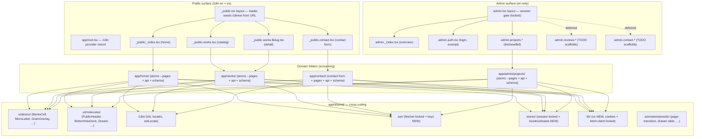
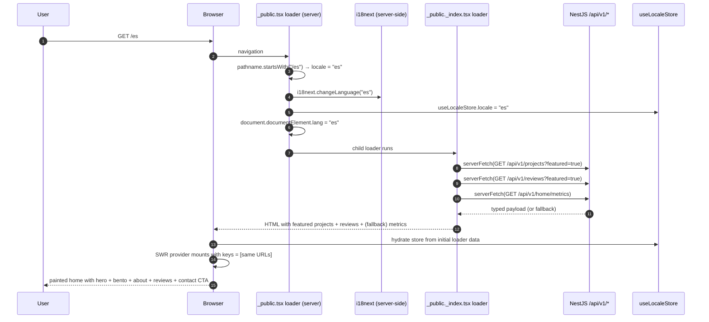
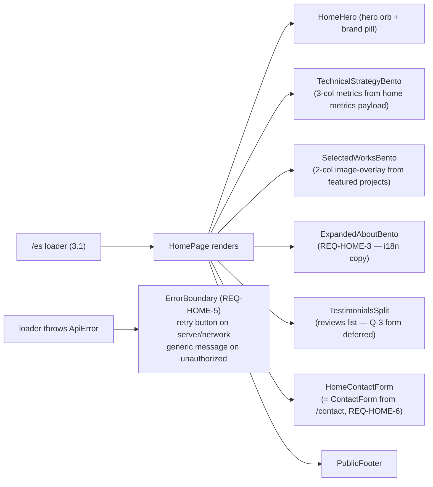
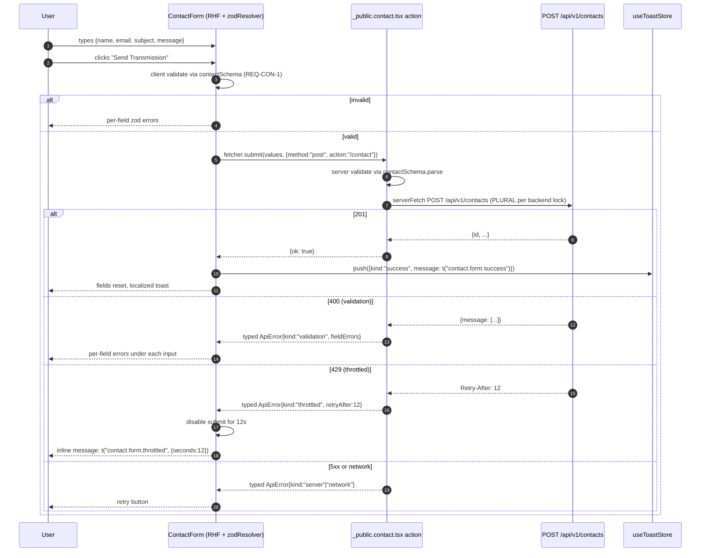
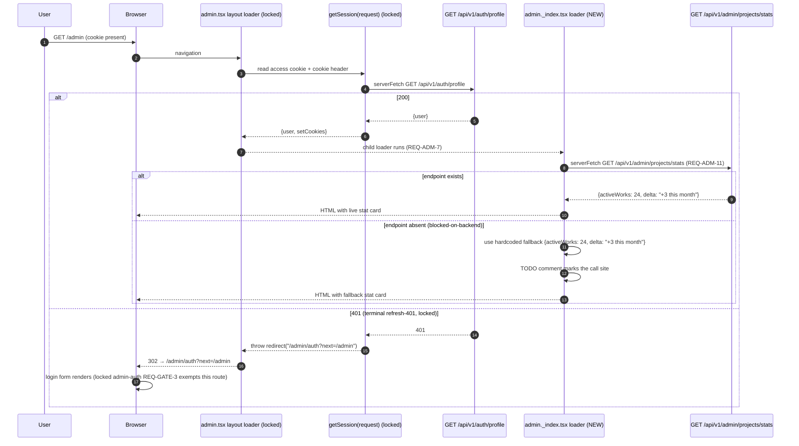

# Design: `portfolio-frontend-v1` — Public Site + Admin v1 Re-Skin

> **Change**: `portfolio-frontend-v1`
> **Status**: design complete (apply-ready)
> **Source of truth**: the corrected `proposal.md` (Decisions 1–10 + Q-1…Q-24 disposition) and the 6 locked delta specs under `openspec/changes/portfolio-frontend-v1/specs/`. This document is the *how*; the proposal is the *what*; the specs are the *contract*.
> **Locked invariants** (not re-debated): single Aurelian obsidian theme; no test runner; no fourth state library; no third locale; admin is English-only; `cn()` lives at `app/shared/lib/cn.ts`; SWR keys mirror REST paths; `ApiError` is the discriminated `kind` union from `openspec/specs/http-client/spec.md`.
> **Cross-project seam**: backend `../roonder-portfolio-backend/openspec/` is read-only. This change mirrors its locked contracts; if the backend drifts, the frontend fixes the drift (per `AGENTS.md` "Mirror the backend's locked specs"). The two `blocked-on-backend` endpoints (REQ-HOME-8, REQ-ADM-11) ship with hardcoded fallbacks.

## Table of contents

1. [Architecture overview](#1-architecture-overview)
2. [Per-route mode decision table](#2-per-route-mode-decision-table)
3. [Sequence diagrams](#3-sequence-diagrams)
4. [Architecture Decision Records (ADRs)](#4-architecture-decision-records-adrs)
5. [Data flow per layer](#5-data-flow-per-layer)
6. [Component architecture](#6-component-architecture)
7. [i18n strategy](#7-i18n-strategy)
8. [API contract mapping](#8-api-contract-mapping)
9. [Animation matrix](#9-animation-matrix)
10. [Error handling per route](#10-error-handling-per-route)
11. [Performance](#11-performance)
12. [Security](#12-security)
13. [Testing posture](#13-testing-posture)
14. [Risks & design-phase mitigations](#14-risks--design-phase-mitigations)
15. [Open questions for `sdd-tasks`](#15-open-questions-for-sdd-tasks)

---

## 1. Architecture overview

The repo already has the screaming-architecture skeleton (`app/{home,works,contact,admin,shared}/`) and the locked HTTP client + admin session bootstrap from the archived `auth-fetch-client` change. This change **FILLS** the skeleton; it does not move it. The only structural moves are: (a) `cn()` migrates from `app/lib/utils.ts` to `app/shared/lib/cn.ts`; (b) the `app/lib/` directory is removed after the migration; (c) `app/components/global/Navbar.tsx` and `app/components/cards/NeuronCard.tsx` are deleted and replaced by the new shared molecules (`PublicHeader`, `MobileHeader`, `BottomNavDock`) and the `BentoCell` atom.



**Single-source-of-truth files** (every change touches one of these and the rest of the tree picks the change up automatically):

| File | Sole owner of | REQ ref |
| --- | --- | --- |
| `app/app.css` | Aurelian obsidian palette + font stack + surface tiers + radii + brand micro-label color + single-theme lock | REQ-THEME-1, REQ-THEME-2, REQ-THEME-3, REQ-THEME-4, REQ-THEME-5, REQ-THEME-6, REQ-THEME-7, REQ-THEME-9, REQ-THEME-10 |
| `app/shared/lib/cn.ts` | `cn()` (the only one) | ADR-11 |
| `app/shared/swr/keys.ts` | every SWR cache key in the app | REQ-HOME-7, REQ-WORKS-6, REQ-ADM-5 |
| `app/shared/i18n/index.ts` | i18next init + locale loading | REQ-I18N-1, 2, 9 |
| `app/shared/i18n/set-locale.ts` | `setLocale(next)` — the single mutation entry | REQ-I18N-4 |
| `app/shared/stores/locale.ts` | `useLocaleStore` — the single locale mirror | REQ-I18N-3 |
| `app/shared/stores/ui.ts` | `useUIStore` — drawer/menu/mobileAdminTab | REQ-ADM-6, REQ-WORKS-4 |
| `app/shared/stores/toasts.ts` | `useToastStore` — toasts across the app | REQ-CON-6, REQ-HOME-6 |
| `app/contact/schema.ts` | contact form zod schema | REQ-CON-1 |
| `app/admin/projects/schema.ts` | project form zod schema | REQ-ADM-4 |

**Data flow at the route level** — every public loader follows this shape (the home loader is the canonical example):

```mermaid
flowchart LR
    A["Browser GET /es/works"] --> B["_public.tsx layout loader<br/>detect locale from URL"]
    B --> C["i18next.changeLanguage('es')<br/>+ useLocaleStore.locale = 'es'"]
    C --> D["seed document.documentElement.lang = 'es'<br/>render data-lang='es' on wrapper"]
    D --> E["child loader runs<br/>serverFetch('/api/v1/projects?isPublished=true&pageSize=100')"]
    E --> F["forward Cookie header<br/>forward Authorization if access cookie present"]
    F --> G["NestJS backend"]
    G --> H["typed payload<br/>{ data: Project[], total, page, pageSize }"]
    H --> I["route page renders<br/>server returns HTML"]
    I --> J["hydrate on client<br/>SWR key = same URL"]
    J --> K["user interaction<br/>(filter / pagination / drawer)"]
```



---

## 2. Per-route mode decision table

The mode column follows the React Router 8 Framework rendering matrix (`renderer: "ssr" | "spa" | "prerender"` in `react-router.config.ts`). All routes default to **SSR** for v1; the pre-render column flags candidates for the follow-up change tracked in proposal §Q-21.

| Path | File | Mode | Why | Spec ref | Pre-render? |
| --- | --- | --- | --- | --- | --- |
| `/` | `_public._index.tsx` | SSR | Bento page; SEO landing; updates weekly | REQ-HOME-1, REQ-HOME-2, REQ-HOME-4 | **Yes** (deferred) |
| `/works` | `_public.works.tsx` | SSR | Full-list fetch + client filter; SEO-critical | REQ-WORKS-1, REQ-WORKS-2, REQ-WORKS-7 | **Yes** (deferred) |
| `/works/:slug` | `_public.works.$slug.tsx` | SSR | Deep-linkable detail; canonical URL | REQ-WORKS-5, REQ-WORKS-7 | **Yes per slug** (deferred) |
| `/contact` | `_public.contact.tsx` | SSR | Form action; no SEO value for prerender | REQ-CON-3, REQ-CON-8 | No |
| `/es/...` (all of the above) | same files via `prefix('es', …)` in `routes.ts:45` | SSR | URL-prefixed twins; same loader logic, different locale seed | REQ-I18N-1, REQ-I18N-8 | mirror of root |
| `/admin` | `admin._index.tsx` | SSR (session) | User-specific dashboard | REQ-ADM-1, REQ-ADM-11 | No |
| `/admin/auth` | `admin.auth.tsx` | SSR (public, exempt) | Login form | (locked `admin-auth` REQ-GATE-3) | No |
| `/admin/auth/logout` | `admin.auth.logout.tsx` | SSR (session) | Logout action | (locked `admin-auth` REQ-LO-1) | No |
| `/admin/projects` | `admin.projects._index.tsx` | SSR (session) | List + filter | REQ-ADM-1 | No |
| `/admin/projects/new` | `admin.projects.new.tsx` | SSR (session) | Create form + action | REQ-ADM-2 | No |
| `/admin/projects/:id` | `admin.projects.$id.tsx` | SSR (session) | Edit + delete | REQ-ADM-3 | No |
| `/admin/reviews*` | (TODO scaffolds) | deferred | Q-3/Q-20 — out of scope for v1 | — | — |
| `/admin/contact*` | (TODO scaffolds) | deferred | Q-3/Q-20 — out of scope for v1 | — | — |

> **Pre-render deferred note**: the home, works catalog, and works detail are the three pre-render candidates per `DESIGN.md §3`. The **decision** (Vercel ISR vs static at build time) is deferred to a separate change per proposal §Q-21. The route files do NOT carry any `prerender` export; the follow-up change adds the config block in `react-router.config.ts` and the deploy pipeline. This change is fully compatible with pre-render because the loaders already return typed payloads on the server.

---

## 3. Sequence diagrams

Five flows cover every critical interaction the change introduces. Pseudocode inside the diagrams is illustrative; the apply phase writes the real code per the relevant spec REQs.

### 3.1 Public request → render (home, `/es`)



### 3.1a Home page composition (REQ-HOME-3 About + REQ-HOME-5 errors)




The SAME molecule (`ContactForm`) is used by both surfaces per REQ-HOME-6 + REQ-CON-2. The home's `ContactForm` is rendered inside the home's bento; the `/contact` page is the standalone route. Both post to the SAME route action (`/contact`) which targets `POST /api/v1/contacts` (plural — see REQ-CON-3 drift note).



### 3.3 Locale switch (`setLocale('es')` from `/`)

The URL is the source of truth per REQ-I18N-8. The cookie is a side effect, not a source.

```mermaid
sequenceDiagram
    autonumber
    participant U as User
    participant LS as LocaleSwitcher
    participant S as setLocale("es") helper
    participant I as i18next
    participant Z as useLocaleStore
    participant D as document
    participant CK as document.cookie
    participant R as useNavigate()

    U->>LS: clicks "ES"
    LS->>S: setLocale("es")
    S->>I: i18next.changeLanguage("es")
    S->>Z: useLocaleStore.locale = "es"
    S->>D: document.documentElement.lang = "es"
    S->>CK: set lang=es; Path=/; SameSite=Lax; Max-Age=31536000
    S->>S: compute equivalent path: "/" → "/es"
    S->>R: navigate("/es")
    R-->>U: browser navigates to /es
    Note over S,U: on /es, _public.tsx loader reads pathname,<br/>seeds i18next with "es", mirrors store (REQ-I18N-9)
```

### 3.4 Admin session-gated request (admin overview, SSR)

The session gate is the locked `admin.tsx` layout loader. This change only fills the route bodies below it (REQ-ADM-7).



### 3.5 Works client-side filter and pagination (catalog page)

Full-list fetch on mount; filter and pagination are pure client-side `useState` derivations per REQ-WORKS-2. No `useMemo` (React Compiler era per `react-19` skill).

```mermaid
sequenceDiagram
    autonumber
    participant U as User
    participant P as WorksPage (client component)
    participant L as _public.works.tsx loader (SSR)
    participant API as GET /api/v1/projects
    participant S as useState (page-local)

    Note over L,API: SSR — runs once on every navigation
    L->>API: serverFetch(GET /api/v1/projects?isPublished=true&pageSize=100)
    API-->>L: {data: Project[], total: N, page: 1, pageSize: 100}
    L-->>P: payload via loaderData
    P->>S: useState query = ""; category = "all"; page = 1

    Note over U,P: user interactions — all client-side
    U->>P: types "monolith" in search
    P->>S: setQuery("monolith")
    P->>P: filtered = projects.filter(p => matches(p, query, category))  # inline, no useMemo
    P->>P: paginated = filtered.slice((page-1)*8, page*8)
    P-->>U: 8 visible cards, pagination count = ceil(filtered/8)

    U->>P: clicks "Architecture" filter chip
    P->>S: setCategory("architecture")
    P->>P: re-filter (same derivation)
    P-->>U: cards narrowed, chip visually active

    U->>P: clicks card → drawer
    P->>S: setDrawerOpen(true); setDrawerSlug(p.slug)  # useUIStore slice
    P-->>U: drawer slides in (motion); /works/:slug link present
```

---


## 4. Architecture Decision Records (ADRs)

One decision per ADR. Each ADR locks a fork the proposal surfaced. Status is `Accepted` unless noted.

### ADR-1: Override shadcn `:root` to Aurelian (theme re-token, not re-install)

- **Status**: Accepted (per proposal §Q-1 disposition + REQ-THEME-1)
- **Context**: shadcn `base-sera` is a light palette (`oklch(1 0 0)`); Aurelian Grid v2 is dark obsidian (`#131314`). A single `components.json` cannot serve both. Per `AGENTS.md` "One shadcn style, one base color" we cannot introduce a second registry.
- **Decision**: keep the shadcn primitive recipes (`app/components/ui/button.tsx`, `field.tsx`, `input.tsx`, `label.tsx`, `separator.tsx`) untouched. Override `:root` shadcn tokens in `app/app.css` to the Aurelian hex values listed in REQ-THEME-1. The existing `@theme inline` block (lines 56–103) already maps `--*` variables into Tailwind tokens, so the rest of the app picks the new palette up with zero changes.
- **Consequences**: shadcn primitives auto-pick Aurelian values; `Button` `bg-primary` is now Aurelian Gold, `Input` bg is now obsidian; visual diff against the 6 mockups is the verification gate. Downstream cost: zero.
- **Cross-references**: REQ-THEME-1, REQ-THEME-6, REQ-THEME-10; ADR-2; the explore report's "Theme conflict resolution" recommendation.

### ADR-2: Drop `@fontsource-variable/noto-sans`; KEEP `@fontsource-variable/playfair-display` as NEW `--font-display`

- **Status**: Accepted (per proposal §Approach "Theme override" + REQ-THEME-3, REQ-THEME-5; corrected post-review — the original explore recommendation to drop Playfair was reversed)
- **Context**: `app/app.css:4-6` imports Noto Sans, Playfair Display, and Hanken Grotesk. The Aurelian design uses Hanken Grotesk for body; Playfair Display is the optional editorial display accent reserved for hero headlines, editorial pull-quotes, and brand micro-labels. Noto Sans is unused.
- **Decision**: drop the Noto Sans `@import`; KEEP Playfair Display `@import`; add a new `--font-display: "Playfair Display Variable", serif;` declaration in the `@theme inline` block. The new `font-display` utility is **opt-in per component** (hero headlines, editorial pull-quotes, brand micro-labels). Default body remains Hanken Grotesk via `--font-sans` per REQ-THEME-4.
- **Consequences**: body text unchanged for existing components; new opt-in utility `font-display` is available for hero/accent surfaces. Verification gate: `bun run typecheck` + grep `noto-sans` returns nothing in `app/`.
- **Cross-references**: REQ-THEME-2 (retire `--rndr-*` shorthand — moved in this same P0 task), REQ-THEME-3, REQ-THEME-4, REQ-THEME-5, REQ-THEME-7 (brand micro-label color), REQ-THEME-9 (single-theme lock — no toggle), REQ-THEME-10; ADR-1, ADR-11.

### ADR-3: Home contact CTA is a real form, NOT a CTA button

- **Status**: Accepted (per proposal §Q-7 disposition + REQ-HOME-6)
- **Context**: The desktop home mockup shows an "Initiate Contact" card with email input + Send Transmission button. Two interpretations: (a) a CTA that links to `/contact`, (b) a real submission. The user disposition locks it as (b).
- **Decision**: render a real `<ContactForm>` molecule (same instance the `/contact` route uses per REQ-CON-2) inside the home's bento. The form shares the `contactSchema` (REQ-CON-1) and posts to the SAME `/contact` route action (REQ-CON-3) → `POST /api/v1/contacts` plural. Success emits a localized toast (REQ-CON-6). Throttled 429 renders inline countdown (REQ-CON-5).
- **Consequences**: one molecule serves both surfaces (DRY); one action handles both submissions; the throttling contract is shared. Downstream cost: zero — `ContactForm` is built once and imported twice.
- **Cross-references**: REQ-HOME-6, REQ-CON-1, REQ-CON-2, REQ-CON-3, REQ-CON-5, REQ-CON-6.

### ADR-4: Locale switch navigates AND sets cookie (URL is the source of truth)

- **Status**: Accepted (per proposal §Q-11 / §Q-16 disposition + REQ-I18N-4, REQ-I18N-8)
- **Context**: when the user clicks "ES" in the public header, two behaviors are possible: (a) just flip the cookie + `lang` attribute, no navigation; (b) navigate to the equivalent path AND set the cookie as a side effect.
- **Decision**: option (b). `setLocale(next)` (the single mutation entry at `app/shared/i18n/set-locale.ts`) does ALL of the following in one call: (1) `i18next.changeLanguage(next)`; (2) updates `useLocaleStore.locale`; (3) writes the `lang` cookie with `Path=/; SameSite=Lax; Max-Age=31536000`; (4) sets `document.documentElement.lang = next`; (5) computes the equivalent path (drops or prepends `/es`) and navigates via `useNavigate()`. The URL prefix remains the source of truth per `DESIGN.md §8`.
- **Consequences**: deep paths round-trip cleanly (`/works/the-monolith-pavilion` ↔ `/es/works/the-monolith-pavilion`); reload-ability is preserved; the cookie is for first-visit detection only; no path rewrites happen on subsequent navigations (the URL is enough).
- **Cross-references**: REQ-I18N-4, REQ-I18N-8, REQ-I18N-9; ADR-7; the `_public.tsx` loader (which reads the URL on every navigation).

### ADR-5: Works client-side filter and pagination (full-list fetch, in-memory derive)

- **Status**: Accepted (per proposal §Q-17 / §Q-18 disposition + REQ-WORKS-2, REQ-WORKS-8)
- **Context**: works catalog could be (a) server-paginated via `?page=N&pageSize=K&category=…&q=…` or (b) client-side filtered from a single full-list fetch. The proposal locks (b) for v1 assuming `<50` projects.
- **Decision**: the `_public.works.tsx` loader fetches `GET /api/v1/projects?isPublished=true&pageSize=100` once per navigation (backend caps `pageSize` at 100, so a v1 catalog of <50 fits in one round-trip). The page holds `{query, category, page}` in `useState`; the filtered + paginated list is derived inline at the top of the component — **no `useMemo`**, no `useCallback` (React Compiler era per `react-19` skill). SWR holds the full-list key so an admin publish invalidates every open catalog tab.
- **Consequences**: simple in-memory filter; URL-shareable filter state is NOT preserved (the deep path `/works/:slug` is the canonical share target per REQ-WORKS-5); the 100-project backend cap means a follow-up SDD change is required once the catalog exceeds 100. Pinned in REQ-WORKS-8.
- **Cross-references**: REQ-WORKS-1, REQ-WORKS-2, REQ-WORKS-6, REQ-WORKS-8; ADR-9.

### ADR-6: Micro-labels — hybrid (brand flourish is fixed; contextual labels i18n'd)

- **Status**: Accepted (per proposal §Q-9 / §Q-10 disposition + REQ-I18N-7)
- **Context**: brand-flourish micro-labels (`[ Precision Metrics ]`, `[ Client Voices ]`, `PROYECTOS`, `SOBRE MÍ`, `Atmósfera Dinámica`, `Technical Strategist`, `[ Initiate Contact ]`) are part of the visual identity. Translating them would dilute the system. Contextual labels (form labels, button copy, helper text, validation messages) need i18n.
- **Decision**: brand-flourish micro-labels are HARD-CODED in the `MicroLabel` atom — they do NOT go through i18n. Contextual labels go through i18n. The split is enforced by the JSON file contents (no `Precision Metrics` key in `app/shared/i18n/locales/en/*.json`) and by a `// BRAND FLOURISH — do not translate` comment in the `MicroLabel` source.
- **Consequences**: the visual identity survives translation; future brand micro-label updates are a single-file edit (`MicroLabel` consumers); contextual copy translates cleanly. Verification gate: grep `Precision Metrics` in `app/shared/i18n/` returns no match.
- **Cross-references**: REQ-I18N-7; ADR-10.

### ADR-7: Works detail = canonical `/works/:slug` route + side drawer (desktop) + bottom sheet (mobile)

- **Status**: Accepted (per proposal §Q-6 disposition + REQ-WORKS-4, REQ-WORKS-5)
- **Context**: the catalog shows a side drawer (desktop) or full-screen bottom sheet (mobile) when a card is tapped. The question: is the drawer/bottom-sheet the ONLY detail surface, or do we ALSO ship a canonical `/works/:slug` route?
- **Decision**: BOTH ship. `/works/:slug` is the canonical, URL-shareable, SEO-friendly destination (REQ-WORKS-5). The drawer is an in-page preview that lets visitors tap a card and inspect it without leaving the catalog. Closing the drawer returns the user to the catalog with the same `{query, category, page}` state. The drawer's "View Live Project" CTA navigates to the canonical URL.
- **Consequences**: deep-linkability is preserved (the most important property); the drawer is a UX enhancement; the bottom sheet (mobile) is the same content but slides up from the bottom (`translate-y-full → translate-y-0`, 500ms, cubic-bezier(0.32,0.72,0,1)). The drawer/sheet state lives in `useUIStore` (`drawerOpen` + `drawerSlug`); the canonical route is pure SSR.
- **Cross-references**: REQ-WORKS-4, REQ-WORKS-5; ADR-5; `useUIStore` slice (proposal §Capabilities).

### ADR-8: Brand canonical name = "Juliam Aponte" (with M); handle = "Roonder"

- **Status**: Accepted (per proposal §Q-8 disposition + REQ-I18N-5, REQ-I18N-6)
- **Context**: the design mockups inconsistently spell the brand name ("Julia Aponte" in header text vs "Juliam Aponte" in image alt). The user's confirmation locks it.
- **Decision**: i18n key `common.brand.name` resolves to `Juliam Aponte` in `en` (and the Spanish translation in `es`). i18n key `common.brand.handle` resolves to `Roonder` (the developer pseudonym). The "Julia" spelling is a typo to fix in P1. Verification: grep `app/home/` and `app/admin/` for the literal string `Aponte` returns ONLY the i18n export or `t('common.brand.name')` calls; no hardcoded `Juliam`/`Julia` strings inside JSX.
- **Consequences**: a single grep proves the invariant; the brand is consistent across en + es; the footer copyright reads `© {year} Juliam Aponte. All rights reserved.` (the year is interpolated from `new Date().getFullYear()`).
- **Cross-references**: REQ-I18N-5, REQ-I18N-6.

### ADR-9: PR slicing — P0 (foundation) / P1 (public surface) / P2 (admin surface)

- **Status**: Accepted (per proposal §PR slicing preview; design-phase confirmation)
- **Context**: the implementation is forecast at ~2,860–4,360 changed lines across 50+ new files — far over the 400-line review budget. The orchestrator's Review Workload Guard requires a chained split.
- **Decision**: three chained PRs in this sequence:
  - **P0 — Foundation** (~600–900 lines): `app/app.css` theme override + font cleanup (drop Noto Sans, wire Playfair Display as `--font-display`); `cn()` move from `app/lib/utils.ts` to `app/shared/lib/cn.ts` (delete `app/lib/`); i18n bootstrap (locales, namespaces, `useLocaleStore`, `setLocale` helper with navigate + cookie side effect); `swrKeys` registry at `app/shared/swr/keys.ts`; `useUIStore` + `useToastStore`; shared atoms (16); shared molecules (11). NO page fills. Reviewable in isolation: home route renders the new theme under the existing `Navbar` + `NeuronCard` placeholders.
  - **P1 — Public surface** (~1,200–1,800 lines): home (`/`, `/es`); works catalog (`/works`, `/es/works`); works detail (`/works/:slug`, `/es/works/:slug`); contact (`/contact`, `/es/contact`). Per-area atoms/molecules/organisms. P0 animation presets become useful here.
  - **P2 — Admin surface** (~800–1,200 lines): admin overview widget; admin projects list/new/edit/delete with the long form; login re-skin to Aurelian visuals (locked `admin-auth` spec untouched); mobile tab bar (Projects / Reviews placeholder / Inbox placeholder).
- **Consequences**: each PR fits the 400-line budget; P1 imports from P0 (sequential, not parallel); P2 imports from P0 + the public atoms P1 lands. Per-PR rollback is independent (proposal §Rollback plan).
- **Cross-references**: proposal §PR slicing preview; the orchestrator's Review Workload Guard; ADR-10.

### ADR-10: Pre-render target deferred (Q-21) — P0/P1/P2 ship with SSR

- **Status**: Accepted (per proposal §Q-21 disposition)
- **Context**: `DESIGN.md §13` flags the pre-render target (Vercel ISR vs static at build time) as an open question. The decision is platform-coupled and would expand scope.
- **Decision**: P0/P1/P2 ship with **SSR** (the default). The home, works catalog, and works detail are flagged as pre-render candidates in §2 of this design but the route files do NOT carry a `prerender` export. The decision lands in a follow-up SDD change that adds the `prerender` block to `react-router.config.ts` and the deploy pipeline.
- **Consequences**: P0/P1/P2 are deployable as-is on any Node-based host; the follow-up change is a config-only diff with no component rewrites. The SSR loaders already return typed payloads, so pre-render is forward-compatible.
- **Cross-references**: proposal §Q-21 disposition; `DESIGN.md §13` open question 1; ADR-9.

### ADR-11: `cn()` consolidation — move to `app/shared/lib/cn.ts`, delete `app/lib/`

- **Status**: Accepted (per proposal §Approach "Shared utilities, no drift" + AGENTS.md)
- **Context**: `cn()` currently lives at `app/lib/utils.ts:1-6`. `AGENTS.md` and `DESIGN.md §7` say it belongs at `app/shared/lib/cn.ts`. Two copies would drift; one copy is the only safe answer.
- **Decision**: P0 moves `cn` from `app/lib/utils.ts` to `app/shared/lib/cn.ts` (the exact same 6 lines). All imports are updated (`~/lib/utils` → `~/shared/lib/cn`). The `app/lib/` directory is deleted. The existing imports in `button.tsx`, `field.tsx`, `input.tsx`, `label.tsx`, `separator.tsx`, and `login.tsx` are updated in the same commit.
- **Consequences**: single source of truth; no import drift; the move is mechanically trivial but the verification gate is `bun run typecheck` + `grep -r "from '~/lib/utils'" app/` returns nothing.
- **Cross-references**: `AGENTS.md` (screaming architecture + atomic design); `tailwind-4` skill (no `var()` in `className`, use `cn()`); proposal §Affected areas.

---

## 5. Data flow per layer

### 5.1 Server layer (loaders + actions)

Every public route is a **thin container** that wires a single `loader` (or `action`) and forwards to a page module under `app/<area>/pages/`. The page module is presentational; the loader is the data layer.

| Surface | Pattern | Example | Spec ref |
| --- | --- | --- | --- |
| Public read | `loader` calls `serverFetch(url)` and returns typed payload | `_public._index.tsx` → `serverFetch('/api/v1/projects?featured=true')` | REQ-HOME-1 |
| Public write | `action` calls `serverFetch(method, url, body)` and returns typed `ok` or `ApiError` | `_public.contact.tsx` → `serverFetch('POST', '/api/v1/contacts', values)` | REQ-CON-3 |
| Admin read (session) | gated by `admin.tsx` loader; child loader runs after 200 | `admin.projects._index.tsx` → `serverFetch('/api/v1/admin/projects?...')` | REQ-ADM-1, REQ-ADM-7 |
| Admin write | `_method` discriminator in `FormData` (`PATCH` vs `DELETE`) | `admin.projects.$id.tsx` → `PATCH /api/v1/admin/projects/:id` | REQ-ADM-3 |

**Schema narrowing** (per locked `http-client` REQ-CORE-4): each loader calls `parsed = schema.parse(raw)` after `serverFetch` so the page consumes `Project[]` not `unknown`. The schemas live in `app/<area>/schema.ts` (one per area).

### 5.2 Client layer (SWR keys)

The `swrKeys` registry is the **single source of truth** for every cache key. Per locked `http-client` REQ-SWR-2, the key equals the URL — no transformation in the fetcher.

```ts
// app/shared/swr/keys.ts (NEW)
export const swrKeys = {
  home: {
    // parallel-safe tuple for the home page's Promise.all
    featured: () => [
      "/api/v1/projects?featured=true",
      "/api/v1/reviews?featured=true",
    ] as const,
    metrics: () => "/api/v1/home/metrics", // REQ-HOME-8 (blocked-on-backend)
  },
  works: {
    list: () => "/api/v1/projects?isPublished=true&pageSize=100",
    bySlug: (slug: string) => `/api/v1/projects/${slug}`,
  },
  contact: {
    submit: () => "/api/v1/contacts", // action target, not a SWR key
  },
  admin: {
    projects: {
      list: (filters?: { page?: number; status?: string }) =>
        `/api/v1/admin/projects?${new URLSearchParams(filters ?? {}).toString()}`,
      byId: (id: string) => `/api/v1/admin/projects/${id}`,
      stats: () => "/api/v1/admin/projects/stats", // REQ-ADM-11 (blocked-on-backend)
    },
    reviews: {
      list: (filters?: { published?: boolean; page?: number }) =>
        `/api/v1/admin/reviews?${new URLSearchParams(filters ?? {}).toString()}`,
    },
    contact: {
      list: (filters?: { unread?: boolean; page?: number }) =>
        `/api/v1/admin/contact?${new URLSearchParams(filters ?? {}).toString()}`,
    },
  },
} as const;
```

**Mutate-on-write** (per locked `http-client` REQ-SWR-2): every successful `action` calls `mutate(key)` for the relevant keys. Example: after a successful project create, `admin.projects.new.tsx` action calls `mutate(swrKeys.admin.projects.list())` so any open `/admin/projects` tab revalidates. After a project edit, `mutate(swrKeys.admin.projects.list())` AND `mutate(swrKeys.admin.projects.byId(id))` so the edit page reflects the new state on re-navigation.

### 5.3 Zustand stores

Four stores total. The session store is locked (from `auth-fetch-client`); the other three are NEW in P0.

| Store | File | State shape | Why | Spec ref |
| --- | --- | --- | --- | --- |
| `useSessionStore` (locked) | `app/shared/stores/session.ts` | `{user, accessToken, status, hydrate, setSession, clearSession}` | Admin session; locked by `admin-auth` REQ-SES-1 | (locked) |
| `useLocaleStore` (NEW) | `app/shared/stores/locale.ts` | `{locale: 'en' \| 'es'}` (selector-only) | Mirror of `i18next.language` for non-hook consumers (e.g. `meta()` exports) | REQ-I18N-3 |
| `useUIStore` (NEW) | `app/shared/stores/ui.ts` | `{mobileMenuOpen, drawerOpen, drawerSlug, activeAdminTab}` | Cross-route UI state (mobile menu, works drawer, mobile admin tab) | REQ-ADM-6, REQ-WORKS-4 |
| `useToastStore` (NEW) | `app/shared/stores/toasts.ts` | `{toasts: Toast[], push(t), dismiss(id)}` | Toast queue with auto-dismiss; used by contact form, review form, SWR errors | REQ-CON-6, REQ-HOME-6 |

**Selector form** (zustand 5 best practice): `useLocaleStore((s) => s.locale)` not `useLocaleStore()`. Multi-field reads use `useShallow` (per `zustand-5` skill). The stores are **never** persisted to localStorage; the session store is intentionally non-persistent (per locked `admin-auth` REQ-SES-2 "No `persist` middleware").

---

## 6. Component architecture

The atomic-design table is split into **shared** (`app/shared/ui/`) and **per-area** (under each domain). Each file is one component.

### 6.1 Shared atoms (`app/shared/ui/atoms/`)

16 atoms, each one a single React component file. The column "Reused on" reflects the design audit captured in `explore.md §Component library plan`.

| Atom | Reused on |
| --- | --- |
| `BentoCell` | Home metrics, works cards, contact CTA, admin overview cards, admin project card |
| `MicroLabel` | Every bento cell (brand flourish; ADR-6) — renders the `text-brand-micro-label` token per REQ-THEME-7 |
| `GrainOverlay` | All public + admin pages (mounted once per layout) |
| `SectionHeading` | Home, works, admin (with optional right-side badge) |
| `IconButton` | Header, admin header, project card delete, review toggle |
| `SearchInput` | Works hero, admin projects list |
| `FilterChip` | Works hero, admin projects filter row |
| `Tag` | Works cards, admin project cards (category labels, status) |
| `PaginationButton` | Works pagination, admin pagination |
| `StatNumber` | Home metrics, admin stat card |
| `StatusBadge` | Admin project card (Published / Draft) |
| `Toggle` | Admin review row (publish/unpublish) |
| `Avatar` | Header, reviews list, mobile admin |
| `EmptyState` | Admin reviews empty state, admin contact empty state |
| `ProgressBar` | Home mobile metrics, admin project card, works card |
| `Sparkline` | Home mobile metrics |

### 6.2 Shared molecules (`app/shared/ui/molecules/`)

11 molecules. The molecules that wrap the **drawer** are intentionally presentational (no SWR, no fetcher); the per-area page decides when to open it via `useUIStore`.

| Molecule | Reused on |
| --- | --- |
| `PublicHeader` | `/`, `/works`, `/works/:slug`, `/contact` (and `/es/...` twins) |
| `PublicFooter` | All public routes |
| `BottomNavDock` | All public mobile + admin mobile |
| `MobileHeader` | All mobile pages |
| `LocaleSwitcher` | Public header (calls `setLocale`) |
| `AdminSidebar` | `/admin/*` desktop (re-skin to Aurelian in P2) |
| `AdminHeader` | `/admin/*` desktop |
| `Drawer` | Works desktop drawer (and any future drawer) |
| `Pagination` | Works catalog, admin projects list |
| `MobileTabBar` | Admin mobile (Projects / Reviews / Inbox placeholders per REQ-ADM-6) |
| `AdminStatCard` | Home metrics bento + admin overview |

### 6.3 Per-area atomic tree (one line per file)

```
app/home/
  atoms/        hero-orb.tsx
  molecules/    hero-profile-card.tsx, metrics-bento.tsx, selected-works-bento.tsx,
                expanded-about-bento.tsx, testimonials-split.tsx, contact-cta.tsx
  organisms/    home-hero.tsx, home-page.tsx
  pages/        home.tsx
  api/          home.ts                  # getHomePageData()
  schema.ts                              # featuredProjectsSchema, homeMetricsSchema, …

app/works/
  atoms/        works-hero-orb.tsx, project-watermark.tsx
  molecules/    works-hero.tsx, project-card.tsx (4 variants per REQ-WORKS-3: featured, compact, data-viz, split), project-meta.tsx,
                drawer-header.tsx, drawer-feature-grid.tsx, drawer-gallery.tsx,
                drawer-action.tsx, mobile-project-card.tsx, mobile-project-drawer.tsx
  organisms/    works-page.tsx, mobile-works-page.tsx, project-drawer.tsx, work-detail.tsx
  pages/        works.tsx, work-detail.tsx
  api/          works.ts                 # getWorksList(), getWorkBySlug()
  schema.ts                              # projectSchema, worksListSchema

app/contact/
  molecules/    contact-form.tsx         # REQ-CON-2 — the SINGLE molecule
  pages/        contact.tsx
  api/          contact.ts               # contactAction()
  schema.ts                              # contactSchema — REQ-CON-1 source of truth

app/admin/projects/
  atoms/        admin-project-status-badge.tsx
  molecules/    admin-project-card.tsx, admin-project-form.tsx (long form),
                admin-project-confirm-modal.tsx (delete)
  organisms/    projects-list.tsx, project-form-organism.tsx
  pages/        list.tsx, new.tsx, edit.tsx
  api/          projects.ts               # list/create/update/delete + getById
  schema.ts                              # createProjectSchema, updateProjectSchema
```

### 6.4 Container / presentational rule

The rule per `AGENTS.md`:

- **Route modules** (`app/routes/*.tsx`) are containers: they own `loader`, `action`, and `meta`, and forward to a page module.
- **Page modules** (`app/<area>/pages/*.tsx`) are presentational: they consume `loaderData`, wire hooks (`useState`, `useForm`, `useFetcher`), and compose organisms.
- **Organisms** are presentational containers: they orchestrate molecules + atoms and may consume hooks but NOT call `serverFetch` or `clientFetch`.
- **Molecules** are pure presentational: they accept props, render atoms, do NOT call hooks like `useFetcher` or `useSWR`.
- **Atoms** are pure: props in, JSX out, no data fetching, no cross-route state.

Logic that needs SWR / context lives in a colocated `hooks/` folder or in `*.container.ts` (the lock-finder rule: if a `*.tsx` imports `useSWR` or `useFetcher`, it is a container and must live in `pages/` or `organisms/`, never in `molecules/` or `atoms/`).

---

## 7. i18n strategy

### 7.1 URL prefix as the single source of truth

Per REQ-I18N-8, the URL prefix is the only input the public layout loader reads. On every navigation:

1. The `_public.tsx` loader (server) reads `request.url.pathname`. If it starts with `/es`, `locale = 'es'`. Otherwise, `locale = 'en'`.
2. `i18next.changeLanguage(locale)` is called server-side.
3. `useLocaleStore.locale` is set via `getState().locale = locale` (or via the boot subscriber per REQ-I18N-3).
4. `document.documentElement.lang = locale` is set in the rendered HTML.
5. The wrapper `<div data-lang={locale}>` continues to emit the attribute (existing behavior in `_public.tsx:27`).

The `lang` cookie and `Accept-Language` header are NOT consulted on a navigation. They are only useful on the very first visit when no URL prefix is present (the implicit redirect sets the cookie and lands the user at the locale-appropriate URL).

### 7.2 Namespace map

Per `explore.md §i18n namespace plan`, the file layout is:

```
app/shared/i18n/
  index.ts                          # i18next init, namespace registration (REQ-I18N-2, REQ-I18N-9)
  set-locale.ts                     # setLocale(next) (REQ-I18N-4) — ADR-4
  locales/
    en/
      common.json                   # brand, nav, footer, locale labels, generic error
      home.json                     # ~50 keys from screens 1+2 in explore.md
      works.json                    # ~40 keys from screens 3+4
      contact.json                  # ~12 keys (form + meta + success + throttled)
      admin.json                    # EN-ONLY — login + projects list/new/edit/form
    es/
      common.json
      home.json
      works.json
      contact.json
      # NO admin.json per locked decision D8
```

### 7.3 `useLocaleStore` shape

```ts
type Locale = "en" | "es";
type LocaleStore = {
  locale: Locale;
  setLocale: (next: Locale) => void; // thin wrapper that calls setLocale() in set-locale.ts
};
```

The store is selector-form-only (per `zustand-5` skill). Non-hook consumers (e.g. `meta()` exports that need `useLocaleStore.getState().locale` to build `<html lang>` / canonical / hreflang) read via `getState()`.

### 7.4 `setLocale(next)` signature

```ts
// app/shared/i18n/set-locale.ts
type Locale = "en" | "es";
export function setLocale(next: Locale, currentPathname: string): void;
```

Steps (single call, in order, per REQ-I18N-4):

1. `i18next.changeLanguage(next)`.
2. `useLocaleStore.getState().locale = next` (synchronous).
3. `document.cookie = "lang=" + next + "; Path=/; SameSite=Lax; Max-Age=31536000"`.
4. `document.documentElement.lang = next`.
5. `const targetPath = computeEquivalentPath(currentPathname, next)` — drops `/es` for `en`, prepends `/es` for `es`.
6. `useNavigate()(targetPath)` — navigates (the `LocaleSwitcher` is a client component, so `useNavigate` is in scope).

### 7.5 Brand-flourish vs contextual (hybrid)

ADR-6 locks the split. Implementation: brand-flourish micro-labels are **string literals** inside the `MicroLabel` atom source (with a `// BRAND FLOURISH — do not translate` comment). Contextual labels are `t('namespace.area.semantic')` calls.

| Layer | Example | Source |
| --- | --- | --- |
| Brand flourish | `[ Precision Metrics ]` | `MicroLabel` source (hardcoded) |
| Contextual | `t('home.metrics.heading')` → "Technical Strategy" | `home.json` |
| Contextual | `t('contact.form.submit')` → "Send Transmission" | `contact.json` |
| Contextual | `t('admin.projects.form.save')` → "Save" | `admin.json` |

### 7.6 Per-route `meta()` with hreflang + canonical (REQ-HOME-4, REQ-WORKS-7, REQ-CON-7)

Every public route exports a `meta({ data, params })` function that returns:

- `title` — localized per active locale (`t('home.meta.title')` → `"Home — Roonder Portfolio"` / `"Inicio — Roonder Portfolio"`).
- `description` — localized from `<area>.meta.description`.
- A `link rel="canonical"` pointing to the current URL in the **active** locale (e.g. for `/es`, the canonical is `https://<host>/es/`).
- Two `link rel="alternate" hreflang="en"` and `hreflang="es"` entries pointing to the same page in the other locale.
- An `x-default` link pointing to the unprefixed URL (for the `en` variant).

For `/works/:slug` (REQ-WORKS-7), the canonical points to the **unprefixed** URL (`https://<host>/works/the-monolith-pavilion`) — slug-bearing canonicals should not duplicate by locale; only the locale alternates vary.

Admin routes (REQ-ADM-10) export a `meta()` with `noindex, nofollow` and NO hreflang (admin is English-only and not indexable).

The active locale is read via `useLocaleStore.getState().locale` (no hook call — `meta()` is a pure function) at the top of the export. The `swrKeys` registry is not involved here; `meta()` is static per route.

### 7.6 Drift notes status

Two drift items exist in the proposal period; both are resolved:

- **Q-8 brand spelling**: resolved as `Juliam Aponte` (with M) per REQ-I18N-5; the "Julia" instances in mockups are typos fixed in P1.
- **i18n keys location** (`common.brand.name`, `common.brand.handle`): resolved per REQ-I18N-5 / REQ-I18N-6. No drift remains.

---

## 8. API contract mapping

The frontend mirrors the backend's locked contracts. Two endpoints are **BLOCKED-ON-BACKEND**; both ship with hardcoded fallbacks (REQ-HOME-8, REQ-ADM-11). The drift note on `POST /api/v1/contacts` is **resolved** — the proposal has been corrected to the locked plural.

### 8.1 Public endpoints

| `swrKeys.*` | Backend endpoint | Method | Auth | Spec ref | Locked backend spec |
| --- | --- | --- | --- | --- | --- |
| `swrKeys.home.featured()` (tuple) | `/api/v1/projects?featured=true` | GET | public | REQ-HOME-1 | `projects-domain/spec.md` Requirement: Public Project List |
| `swrKeys.home.featured()` (tuple) | `/api/v1/reviews?featured=true` | GET | public | REQ-HOME-1 | `reviews-domain/spec.md` (out of scope to modify; consume as-is) |
| `swrKeys.home.metrics()` (fallback only) | `/api/v1/home/metrics` | GET | public | REQ-HOME-8 (BLOCKED-ON-BACKEND) | not in backend `openspec/specs/` — fallback `{activeWorks:124, …}` |
| `swrKeys.works.list()` | `/api/v1/projects?isPublished=true&pageSize=100` | GET | public | REQ-WORKS-1, REQ-WORKS-8 | `projects-domain/spec.md` Requirement: Public Project List |
| `swrKeys.works.bySlug(slug)` | `/api/v1/projects/:slug` | GET | public | REQ-WORKS-5 | `projects-domain/spec.md` Requirement: Public Project Detail by Slug |
| (action only — not a SWR key) | `/api/v1/contacts` | POST | public | REQ-CON-3 | `domain-contact/specs/contact/spec.md` Requirement: Public POST contact endpoint (PLURAL — locked) |

### 8.2 Admin endpoints

| `swrKeys.*` | Backend endpoint | Method | Auth | Spec ref | Locked backend spec |
| --- | --- | --- | --- | --- | --- |
| `swrKeys.admin.projects.list(filters)` | `/api/v1/admin/projects?...` | GET | bearer | REQ-ADM-1 | `projects-domain/spec.md` Requirement: Admin Project Create (same controller; admin route) |
| `swrKeys.admin.projects.byId(id)` | `/api/v1/admin/projects/:id` | GET | bearer | REQ-ADM-3 | `projects-domain/spec.md` Requirement: Admin Project Update |
| `swrKeys.admin.projects.stats()` (fallback only) | `/api/v1/admin/projects/stats` | GET | bearer | REQ-ADM-11 (BLOCKED-ON-BACKEND) | not in backend `openspec/specs/` — fallback `{activeWorks:24, delta:"+3 this month"}` |
| (action only) | `/api/v1/admin/projects` | POST | bearer | REQ-ADM-2 | `projects-domain/spec.md` Requirement: Admin Project Create |
| (action only) | `/api/v1/admin/projects/:id` | PATCH | bearer | REQ-ADM-3 | `projects-domain/spec.md` Requirement: Admin Project Update with project_urls DIFF Semantics |
| (action only) | `/api/v1/admin/projects/:id` | DELETE | bearer | REQ-ADM-3 | `projects-domain/spec.md` Requirement: Admin Project Delete with Cascade |
| `swrKeys.admin.reviews.list(filters)` (deferred route — out of scope for v1) | `/api/v1/admin/reviews` | GET | bearer | (deferred) | `reviews-domain/spec.md` |
| `swrKeys.admin.contact.list(filters)` (deferred route — out of scope for v1) | `/api/v1/admin/contact` | GET | bearer | (deferred) | `domain-contact/spec.md` Requirement: Admin list contact endpoint (protected) |

### 8.3 Locked auth endpoints (consumed, not modified)

| Backend endpoint | Method | Locked spec | Consumer |
| --- | --- | --- | --- |
| `/api/v1/auth/login` | POST | `auth-domain/spec.md` Requirement: Login Endpoint | `admin.auth.tsx` action (already wired by archived change) |
| `/api/v1/auth/refresh` | POST | `auth-domain/spec.md` Requirement: Refresh Token Rotation | `core.ts` (already wired; silent refresh on 401) |
| `/api/v1/auth/logout` | POST | `auth-domain/spec.md` Requirement: Logout Endpoint | `admin.auth.logout.tsx` action (already wired) |
| `/api/v1/auth/profile` | GET | `auth-domain/spec.md` Requirement: Profile Endpoint | `admin.tsx` layout loader (already wired; session gate) |

### 8.4 Drift resolution log

| Drift | Source | Resolution | Status |
| --- | --- | --- | --- |
| `POST /api/v1/contact` (singular) → `/api/v1/contacts` (plural) | explore + proposal vs. backend `domain-contact/spec.md` Requirement: Public POST contact endpoint | proposal corrected to plural; design uses plural everywhere (REQ-CON-3, REQ-HOME-6) | **RESOLVED 2026-08-26** |
| `GET /api/v1/home/metrics` may not exist | explore Q-12 + REQ-HOME-8 | hardcoded fallback `{activeWorks:124, strategicAttacks:48, techImplementations:92}`; TODO comment; follow-up SDD change adds live fetch | **BLOCKED-ON-BACKEND** |
| `GET /api/v1/admin/projects/stats` may not exist | explore Q-12 + REQ-ADM-11 | hardcoded fallback `{activeWorks:24, delta:"+3 this month"}`; TODO comment; follow-up SDD change adds live fetch | **BLOCKED-ON-BACKEND** |
| Brand spelling "Julia" vs "Juliam" | explore Q-8 | canonical = "Juliam Aponte" (with M); handle = "Roonder" (REQ-I18N-5, REQ-I18N-6) | **RESOLVED** |
| Q-9/Q-10 micro-label translation | explore Q-9/Q-10 | brand flourish stays untranslated (ADR-6); contextual labels i18n | **RESOLVED** |

---

## 9. Animation matrix

Per `DESIGN.md §9`, the choice between `motion` and `animejs` is **per use case**, not per habit. The matrix below locks the choice for each surface. Every animation MUST honor `prefers-reduced-motion: reduce` (the motion library does this automatically via its `MotionConfig`; CSS keyframes need a `@media (prefers-reduced-motion: reduce) { animation: none }` guard).

| Surface | Trigger | Library | Preset (in `app/shared/animation/presets/`) | Spec ref |
| --- | --- | --- | --- | --- |
| Drawer (desktop) open/close | `useUIStore.drawerOpen` flips | **motion** | `drawer-slide.ts` — `initial={{x: "100%"}} animate={{x: 0}} exit={{x: "100%"}} transition={{ease: [0.16, 1, 0.3, 1], duration: 0.5}}` | REQ-WORKS-4 |
| Bottom sheet (mobile) open/close | same | **motion** | `bottom-sheet.ts` — `initial={{y: "100%"}} animate={{y: 0}} exit={{y: "100%"}} transition={{ease: [0.32, 0.72, 0, 1], duration: 0.5}}` | REQ-WORKS-4 |
| Card hover lift (bento) | CSS `group-hover` | **CSS** | `transition-all duration-300 hover:-translate-y-1` (no library) | (works catalog) |
| Card image zoom on hover | CSS `group-hover` | **CSS** | `transition-transform duration-700 group-hover:scale-105` | (works catalog) |
| CTA hover glow | CSS hover | **CSS** | `hover:shadow-[0_0_20px_rgba(212,175,55,0.3)]` | (home + admin) |
| Hero orb blur | mount | **CSS** (or animejs if choreography needed) | `@keyframes blur { ... }` (a single keyframe; no library needed) | (home hero) |
| Page transitions | route change | **motion** (opt-in) | `page-transition.ts` — `<AnimatePresence>` wrapper on `<Outlet/>` in layouts (P0 lands the preset, P1 wires it) | (cross-cutting) |
| Scroll reveal of bento cards | viewport entry | **animejs** for choreographed sequences, **CSS** for simple reveals | `scroll-reveal.ts` (animejs timeline) — P0 lands the preset; P1 USES it per `DESIGN.md §9` | (home, works) |
| Toast appear/disappear | push/dismiss | **motion** | `toast.ts` — `<AnimatePresence>` per toast with `initial={{opacity:0, y:-10}} animate={{opacity:1, y:0}} exit={{opacity:0}}` | REQ-CON-6 |
| Form submit button pending | `fetcher.state === "submitting"` | **CSS** | shadcn `Button` already has a pending state via `disabled`; no extra animation | REQ-CON-2 |
| Filter chip activation | click | **CSS** | `transition-colors duration-200` | (works filter) |
| Drawer close on ESC / backdrop | keyboard / click | **CSS** (no animation) | the close handler is synchronous | REQ-WORKS-4 |

**Rule**: prefer CSS for hover/transition-driven micro-interactions; reach for `motion` for state-driven mount/unmount (`AnimatePresence`) and layout animations; reach for `animejs` only for time-line choreography (scroll reveal sequences). Both libraries ship in `package.json`; P0 creates the preset files; P1 wires them.

**`prefers-reduced-motion`**: every preset guards with `if (typeof window !== "undefined" && window.matchMedia("(prefers-reduced-motion: reduce)").matches) return;` before scheduling any animation. The home page also includes a `<style>` guard inside `GrainOverlay` so the noise does not scroll-animate on reduced-motion users.

---

## 10. Error handling per route

Per `DESIGN.md §10` and the locked `http-client` REQ-CORE-2 + REQ-ERR-1..3, every error is a typed `ApiError { kind, ... }` discriminated union. The handling surface is:

### 10.1 Loader errors → `ErrorBoundary`

Every route file exports `ErrorBoundary({ error })`. The boundary reads `error` and renders a typed branch per `error.kind`:

| `ApiError.kind` | UI |
| --- | --- |
| `unauthorized` | (rare on public; on admin, the gate already redirected) — render a generic "Sign in again" message |
| `forbidden` | render a localized "You don't have access to this resource" |
| `notFound` | render the route's "not found" page (e.g. "Project not found" for works detail) |
| `conflict` | render a localized "Conflict" message with a retry |
| `throttled` | render a countdown if `retryAfter` is set; otherwise "Please wait" |
| `validation` | render per-field errors (only valid for forms; loaders typically don't get this) |
| `server` | render a retry button + a localized "Something went wrong" |
| `network` | render a retry button + a localized "You appear to be offline" |

### 10.2 Action errors → form inline + toast

The action returns a typed `ApiError` (not throws). The form's `fetcher.data` holds the typed envelope; the `<FormError />` molecule reads it and renders per-field errors under the offending input (REQ-CON-4 + REQ-HOME-6). The success toast is via `useToastStore.push({ kind: "success", message: t("contact.form.success") })`.

### 10.3 SWR errors → toast + retry

A `useSWR(key, swrFetcher, { onError })` handler pushes a toast via `useToastStore` for any non-2xx. The component shows a "Retry" button that re-validates. No silent infinite retries.

### 10.4 429 with `Retry-After`

Per locked `http-client` REQ-ERR-3, when the backend returns 429 with a `Retry-After` header, the typed `ApiError { kind: "throttled", retryAfter: <seconds> }` is constructed. The contact form (the only write surface with throttling today) renders an inline countdown and disables the submit button until the timer elapses (REQ-CON-5).

### 10.5 Offline banner

A single `<OfflineBanner />` component (atom in `app/shared/ui/atoms/`) listens to `navigator.onLine` and `online`/`offline` events. When the browser is offline, the banner renders at the top of the page with the message from `t('common.error.offline')`. The banner is `fixed top-0 w-full bg-warning text-warning-foreground text-center py-2 z-50`. SWR continues to serve `fallbackData` from the loader so the page remains navigable.

### 10.6 Per-route error matrix

| Route | Loader 500 | Loader 401 | Loader 404 | Action 400 | Action 429 | Action 500 |
| --- | --- | --- | --- | --- | --- | --- |
| `/`, `/es` | ErrorBoundary retry (REQ-HOME-5) | n/a (public) | n/a | inline (n/a — no action) | n/a | n/a |
| `/works`, `/es/works` | ErrorBoundary retry | n/a | n/a | n/a | n/a | n/a |
| `/works/:slug`, `/es/works/:slug` | ErrorBoundary retry | n/a | ErrorBoundary "Project not found" (REQ-WORKS-5) | n/a | n/a | n/a |
| `/contact`, `/es/contact` | n/a (loader is no-op per REQ-CON-8) | n/a | n/a | per-field (REQ-CON-4) | countdown (REQ-CON-5) | retry button (REQ-ADM-9 pattern) |
| `/admin` | ErrorBoundary retry (REQ-ADM-9) | gate redirect (locked `admin-auth` REQ-GATE-2) | n/a | n/a | n/a | n/a |
| `/admin/projects` | ErrorBoundary retry (REQ-ADM-9) | gate redirect | n/a | n/a | n/a | n/a |
| `/admin/projects/new` | n/a | gate redirect | n/a | per-field (REQ-ADM-2) | n/a (admin POST is not throttled) | retry button (REQ-ADM-9) |
| `/admin/projects/:id` | ErrorBoundary retry (REQ-ADM-9) | gate redirect | ErrorBoundary "Project not found" (REQ-ADM-3) | per-field | n/a | retry button (REQ-ADM-9) |

---

## 11. Performance

### 11.1 SSR by default

Every route is SSR. The home loader does one `Promise.all` of three fetches (REQ-HOME-1). The works catalog loader does one fetch (REQ-WORKS-1). The contact loader is a no-op (REQ-CON-8). The admin layout loader does one fetch (`getSession`) and each admin child loader does its own fetches in parallel.

### 11.2 Font loading

- `@fontsource/hanken-grotesk` is the body family and is imported via `app/app.css:6` (kept per REQ-THEME-4). Hanken Grotesk's default weights (400/500/600/700) cover the design's typography tokens (the `font-weight` values in `assets/design/aurelian_grid_v2/DESIGN.md`).
- `@fontsource-variable/playfair-display` is imported (kept per REQ-THEME-5) and exposed via the new `font-display` utility — opt-in per component, used for hero headlines, editorial pull-quotes, and brand micro-labels.
- `@fontsource-variable/noto-sans` is **dropped** (REQ-THEME-3).
- All three fonts use `@fontsource`'s CDN-friendly file layout; the Vite build emits hashed asset URLs so the browser can cache them across navigations. No `font-display: swap` override is needed — `@fontsource` sets it automatically.

### 11.3 Grain overlay

The `GrainOverlay` atom (REQ-THEME-8) mounts once per layout (`_public.tsx` and `admin.tsx`). It is a `fixed inset-0 pointer-events-none z-[100] opacity-[0.05]` div with `bg-[url(...noise.svg...)]`. The asset URL is hardcoded to `https://grainy-gradients.vercel.app/noise.svg` (per the mockups); a follow-up task may self-host the SVG to remove the third-party dependency.

The overlay is mounted ONCE, not per page, so it does not add to per-route HTML weight. The single `<div>` is ~50 bytes; the SVG is fetched lazily by the browser and cached.

### 11.4 Bento CSS Grid

Per `aurelian_grid_v2/DESIGN.md`, the bento layout uses CSS Grid with `gap-bento-gap` (16px) and `max-w-container-max` (1280px). Tailwind 4 utilities: `grid grid-cols-1 md:grid-cols-2 lg:grid-cols-3 gap-4 max-w-7xl mx-auto`. The cells are CSS Grid items with `auto-rows-min` so the layout adapts to content. No JavaScript layout calculation.

### 11.5 Image loading

The mockups show project hero images and bento cell images. The apply phase uses:

- `loading="lazy"` on every image below the fold.
- `decoding="async"` on every image.
- `srcset`/`sizes` for responsive sizing (the backend's `coverImage` is a single URL; the apply phase documents that a follow-up SDD change adds the responsive image transform — out of scope for v1).
- `width` and `height` attributes to reserve layout space and avoid CLS.

### 11.6 SWR dedupe

Per locked `http-client` REQ-SWR-2, SWR keys equal the URL. Two components on the same page that read `useSWR('/api/v1/projects?featured=true', swrFetcher)` share a single fetch. The works catalog dedupes with the home page's featured SWR key when both are mounted simultaneously (e.g. a tab in the background).

### 11.7 Bundle size guardrail

The change does NOT introduce any new runtime dependencies (proposal §Success criteria: "Zero new runtime dependencies in `package.json`"). The 16 atoms and 11 molecules are local files; the libraries used (`motion`, `animejs`, `swr`, `zustand`, `react-hook-form`, `zod`, `i18next`, `react-i18next`) are already in `package.json`. The bundle size increase is the cost of the new component code plus the JSON locale files (~3 KB per locale for all four namespaces).

### 11.8 `bun run build` gate

The verify phase runs `bun run build` after `bun run typecheck`. A successful build proves the Vite + react-router pipeline can tree-shake the components and emit the production bundle.

---

## 12. Security

### 12.1 Session gate (admin only, locked)

Per locked `admin-auth` REQ-GATE-1..4, the `admin.tsx` layout loader is the **only** session gate. On a 401 from `/api/v1/auth/profile`, it throws `redirect('/admin/auth?next=' + encodeURIComponent(currentPath))`. Admin child routes do NOT add a second gate (REQ-ADM-7). The `next` param is sanitized per locked `admin-auth` REQ-NEXT-1 (same-origin AND starts with `/admin/`).

### 12.2 Cookie spec mirror

The cross-project cookie spec lives in `DESIGN.md §5` and is the single source of truth. This change does NOT modify any cookie behavior:

| Cookie | Lifetime | `httpOnly` | `secure` | `sameSite` | `path` | Cleared on |
| --- | --- | --- | --- | --- | --- | --- |
| `rt` (refresh) | `JWT_REFRESH_EXPIRES_IN` (default 30d) | **true** | true | lax | `/` | `/auth/logout`, refresh 401/reuse-detected |
| `access` (JWT) | `JWT_EXPIRES_IN` (default 15m) | **false** | true | lax | `/` | frontend logout action (`Max-Age=0`) |
| `lang` (i18n) | 1 year (`Max-Age=31536000`) | **false** | true (in prod) | lax | `/` | (never — set once and forgotten) |

The `lang` cookie is a side effect of `setLocale()` per ADR-4. It is `httpOnly: false` because `setLocale` writes it from client-side JS. It does not carry sensitive data (the locale is already in the URL).

### 12.3 No secrets in code

`AGENTS.md` already mandates this. The change does not introduce any environment variable usage. The backend's `RESEND_*` env vars are backend-only. The frontend reads no secrets at runtime.

### 12.4 CORS posture

Per `DESIGN.md §5`, the backend is configured with `CORS origin: ${FRONTEND_URL}` and `credentials: true`. The frontend's `serverFetch` (server-side) and `clientFetch` (client-side) both forward cookies via `credentials: 'include'` (the latter is unconditional per the current `client.ts`; locked `http-client` REQ-CLI-1 — the design does NOT modify this).

### 12.5 Bearer injection

Per locked `http-client` REQ-CLI-1, `clientFetch` injects `Authorization: Bearer <accessToken>` from `useSessionStore.getState().accessToken` on every request EXCEPT auth endpoints (login, refresh, logout — per REQ-CLI-2). The `skipAuth` flag exists in `core.ts` for this purpose. No change to this contract.

### 12.6 Form CSRF

React Router 8 Server Actions (when used) require a same-origin POST. The current change uses `fetcher.submit` with `method: 'post'` to the route's `action` — same-origin by construction. No CSRF token is needed; the browser's same-origin policy + `credentials: 'include'` is sufficient.

### 12.7 Public POST throttling

Per the locked `domain-contact` spec, the public `POST /api/v1/contacts` endpoint has a per-IP `@Throttle()` decorator with `CONTACT_THROTTLE_*` env vars. The frontend does NOT add a frontend rate limit; the backend is the single source of throttling (REQ-CON-5). The 429 response is rendered inline per REQ-CON-5; the form is disabled for the `Retry-After` seconds.

### 12.8 Image upload deferred

Per REQ-ADM-4 + the proposal's out-of-scope list, the admin project form accepts a `coverImage` URL (string) not a file upload. The backend does not yet expose an upload endpoint. Multipart upload is a future SDD change.

---

## 13. Testing posture

### 13.1 Today (this change)

`bun run typecheck` is the **sole** automated quality gate (per `openspec/config.yaml`). The change introduces:

- **No new test runner** (proposal §Q-23 + `openspec/specs/testing-capabilities.md`).
- **No new linter** (`openspec/config.yaml` `quality.linter.available: false`).
- **No new formatter** (`.prettierrc` present but `prettier` not in `package.json`).

Every apply-phase commit MUST pass `bun run typecheck` (proposal §Success criteria) and `bun run build` (the only build gate; proposal §Verify).

### 13.2 Manual smoke checklist (per route, per `verify-report.md` template)

The verify phase runs the manual checklist per route. The checklist is the spec scenarios rendered as `Given/When/Then` + a manual action.

| Route | Manual checks |
| --- | --- |
| `/` (en) | hero renders; bento metrics render with hardcoded fallback or live; selected works bento shows 2 cards; about section renders; reviews list renders; home contact form submits → success toast |
| `/es` | same as `/` but in Spanish; all copy from `es/*.json`; brand name resolves to `t('common.brand.name')` in Spanish |
| `/works` (en) | catalog renders 4 card variants; search filters; category chip filters; pagination works; clicking card opens drawer |
| `/works/the-monolith-pavilion` | detail renders; hero image; body; gallery; CTA |
| `/contact` | form renders 4 fields; submit success → toast; 429 → countdown; 400 → per-field |
| `/admin/auth` | Aurelian re-skin renders; login works |
| `/admin` | gate allows signed-in; redirects unsigned-in to `/admin/auth?next=/admin` |
| `/admin/projects` | list renders; status filter narrows; new project CTA visible |
| `/admin/projects/new` | long form renders; submit creates; redirects to edit page |
| `/admin/projects/:id` | pre-populated; save updates; delete requires confirm |

### 13.3 Future (testing-capabilities change)

When the testing SDD change lands (tracked in `openspec/specs/testing-capabilities.md`), the matrix is:

| Layer | Tool | Lives in |
| --- | --- | --- |
| Unit | Vitest | `app/**/*.test.ts` colocated |
| Component | Vitest + Testing Library | `app/**/*.test.tsx` colocated |
| E2E | Playwright | `e2e/` (project root) |
| Type | `tsc` via `bun run typecheck` | always on |

Strict TDD is OFF for this change (`openspec/config.yaml` `testing.strict_tdd: false`).

---

## 14. Risks & design-phase mitigations

The 8 risks in the proposal are carried forward; each gets a design-phase mitigation. Two new risks surfaced during design-phase analysis (R-9 and R-10).

| ID | Risk | Likelihood | Design-phase mitigation |
| --- | --- | --- | --- |
| **R-1** | Aurelian obsidian vs shadcn `base-sera` light — wrong contrast on shadcn primitives | Med | ADR-1 overrides `:root` in one file (`app/app.css`); the `@theme inline` block already maps vars into Tailwind tokens; visual diff against `assets/design/*/screen.png` during verify |
| **R-2** | Dropping Noto Sans breaks any pre-existing reference | Low | Grep `noto-sans` in `app/` returns 0 matches today; REQ-THEME-3 scenario asserts Hanken Grotesk still renders. Playfair Display is KEPT (no risk) |
| **R-3** | v1 is ~2,860–4,360 lines over the 400-line budget | High | ADR-9 splits into P0/P1/P2 chained PRs; each is inside the budget; the orchestrator's Review Workload Guard enforces |
| **R-4** | i18n bootstrap missing; all keys render as raw `home.hero.headline` | Med | P0 ships the entire i18n infrastructure (init + namespaces + `useLocaleStore` + `setLocale`); P1 wires the first `t()` call as a smoke test |
| **R-5** | No test runner; no safety net for theme/i18n/contact form regressions | Med | `bun run typecheck` is the only automated gate; manual smoke checklist per route in verify; the testing follow-up change is already tracked |
| **R-6** | Backend mirror drift (renamed endpoint, new cookie attribute, new error kind) | Med | Read `../roonder-portfolio-backend/openspec/specs/` at design start; flag the 2 drifts (`POST /api/v1/contacts` plural — RESOLVED; `GET /api/v1/home/metrics` and `GET /api/v1/admin/projects/stats` not yet present — flagged BLOCKED-ON-BACKEND with fallback) |
| **R-7** | No pre-render target decision | Low | ADR-10 defers Q-21 to a follow-up SDD change; P0/P1/P2 are SSR; the follow-up is config-only and forward-compatible |
| **R-8** | Two `cn()` definitions could drift | Low | ADR-11 moves the file, updates every import, deletes `app/lib/`; single source verified by grep |
| **R-9** | **NEW** — `useUIStore.drawerOpen` initial value is `false`; if the catalog page mounts and immediately calls `setDrawerOpen(true)` in an effect, the drawer flashes open during SSR-then-hydrate | Low | The drawer is initially `closed`; opening it is a user action (`onClick` on a card). No effect-based auto-open anywhere. The initial render always shows the catalog, never the drawer |
| **R-10** | **NEW** — the home contact form lives at the bottom of the page; if the bento is long enough to push it below the fold, the success toast may render off-screen | Low | The toast is `fixed top-4 right-4 z-[200]`; regardless of scroll position, it renders in the viewport. The form's `onSubmit` also calls `formRef.current?.scrollIntoView({behavior:"smooth"})` before the request fires |

**Top 3 design-phase risks**: R-3 (size budget — the chained PR split is the only mitigation), R-6 (backend drift — the 2 BLOCKED-ON-BACKEND endpoints are the most likely future drift), R-4 (i18n bootstrap — P0 must land clean for P1 to function).

---

## 15. Open questions for `sdd-tasks`

`sd
d-tasks` must resolve these BEFORE the apply phase begins. Each item lists the question, why it matters, and the constraint the answer must satisfy.

### 15.1 P0 task ordering

**Question**: should the i18n bootstrap land BEFORE or AFTER the `cn()` move in P0?
**Why it matters**: the P0 verify gate exercises a single `t('home.hero.headline')` call in a test route to prove i18n works. If the `cn()` move breaks something (e.g. an import the apply author missed), the i18n smoke test cannot run. If i18n lands first and the `cn()` move breaks the test route's `cn()` import, the smoke test fails for the wrong reason.
**Constraint**: P0 tasks MUST be sequenced so each gate test exercises only the change it claims to. The recommended order is: (1) theme override + font cleanup; (2) `cn()` move + `app/lib/` deletion; (3) `swrKeys` registry; (4) i18n bootstrap + `useLocaleStore` + `setLocale`; (5) `useUIStore` + `useToastStore`; (6) shared atoms; (7) shared molecules; (8) smoke test route (`/__p0-smoke` or similar) renders the new theme + one `t()` call.

### 15.2 P1 task ordering

**Question**: does the home page land BEFORE the contact page, or the other way around?
**Why it matters**: the home contact form REUSES the `ContactForm` molecule from the contact page (REQ-HOME-6 + REQ-CON-2). If the home page lands first and tries to import `ContactForm`, the import is unresolvable.
**Constraint**: P1 tasks MUST sequence the contact `ContactForm` molecule (under `app/contact/molecules/contact-form.tsx`) BEFORE the home page's `HomeContactForm` organism. The `/contact` page is a thin wrapper around `ContactForm`; the home page renders `ContactForm` inside the bottom bento. Recommended order: (1) `contact/schema.ts`; (2) `contact/molecules/contact-form.tsx`; (3) `contact/api/contact.ts` + `_public.contact.tsx` action; (4) `contact/pages/contact.tsx` + route fill; (5) home page (which now imports `ContactForm` cleanly).

### 15.3 Works detail vs catalog — same PR or different?

**Question**: should `/works/:slug` and `/works` land in the same P1 PR or be split?
**Why it matters**: the catalog loader fetches the full list (REQ-WORKS-1); the detail loader fetches the single project (REQ-WORKS-5). They share the `ProjectCard` molecule (4 variants) and the `Drawer` (REQ-WORKS-4). Splitting them inflates the PR count without reducing review surface.
**Constraint**: keep them in the same P1 PR. The detail page is small (~100 lines including loader + page + meta); it pulls from the catalog's molecules; splitting forces the catalog PR to expose a public `ProjectCard` API that the detail PR then re-imports.

### 15.4 Admin re-skin scope

**Question**: which elements of `app/admin/auth/pages/login.tsx` need Aurelian re-skin in P2 vs unchanged?
**Why it matters**: the locked `admin-auth` spec defines the form's BEHAVIOR (REQ-LOG-1..6). The re-skin is purely visual (REQ-ADM-8). Mixing the two makes the PR hard to review.
**Constraint**: P2's re-skin task changes ONLY: (a) the page background to `bg-background` (Aurelian obsidian); (b) the submit button to `bg-primary` (Aurelian Gold); (c) the input background to `bg-input` (Aurelian tertiary); (d) the focus ring to `ring-ring` (Aurelian surface-tint). It does NOT change: the form schema (`admin/auth/schema.ts`), the login action (`admin/auth/api/login.ts`), the form's submit logic, the error rendering, or the `useSessionStore` interaction.

### 15.5 Animation preset activation

**Question**: do the animation presets created in P0 land in P1 active or inert?
**Why it matters**: P0 lands the preset files (`app/shared/animation/presets/{page-transition,drawer-slide,scroll-reveal,micro-hover}.ts`). If they are inert in P0 (no component imports them), the verify gate does not prove they work.
**Constraint**: P0 lands the presets with at least one consumer per preset (the drawer preset is consumed by a future placeholder in P1; the page-transition preset is consumed by `_public.tsx` wrapping the `<Outlet/>`; the scroll-reveal preset is consumed by the home hero orb; the micro-hover preset is consumed by `BentoCell`). The P0 smoke test asserts each preset runs without console errors on a real hover/scroll.

### 15.6 Two `blocked-on-backend` endpoints — confirm before P2

**Question**: are `GET /api/v1/home/metrics` and `GET /api/v1/admin/projects/stats` real endpoints by the time P2 lands?
**Why it matters**: the design ships with hardcoded fallbacks (REQ-HOME-8, REQ-ADM-11). If the backend ships the endpoints by P2, the apply phase swaps the fallback for the live call.
**Constraint**: P1's verify phase reads `../roonder-portfolio-backend/openspec/specs/` for a `home-domain` or `home-metrics` capability and a `projects-stats` requirement. If present, P1 includes the swap. Otherwise, the fallback stays and a follow-up SDD change is filed (per the proposal's success criteria + this design §14).

### 15.7 Pre-render follow-up timing

**Question**: when does the pre-render target (Vercel ISR vs static at build time) change ship?
**Why it matters**: ADR-10 defers it. The home + works + works/:slug are SEO-critical. If the follow-up change lands AFTER v1 ships, the SEO impact is delayed by however long the follow-up takes.
**Constraint**: the follow-up is its own `/sdd-new` change. It is NOT part of this change. It may be filed in parallel with v1's verify phase; that is the orchestrator's call.

### 15.8 Per-icon migration map (lucide-react)

**Question**: which `lucide-react` icon replaces each Material Symbol in the mockups?
**Why it matters**: the mockups use Material Symbols Outlined (loaded via Google Fonts CSS); the project ships `lucide-react`. AGENTS.md "One icon library" forbids a second library.
**Constraint**: P0 lands a per-icon migration map as a single file at `assets/design/icon-migration.md` with two columns (Material Symbol name → `lucide-react` import). Every component in P1/P2 imports from `lucide-react` only. The map is the single source of truth for which icon to use where. The map MUST cover at minimum: home (palette, send, alternate_email, public, work, mail, dns, data_object), works (search, grid_view, view_agenda, info, open_in_new, ios_share, close, chevron_left, chevron_right, format_quote, arrow_forward, arrow_outward), admin (home, dashboard, folder_managed, mail, logout, shield_person, add, search, more_vert, inbox, rate_review, add_photo_alternate, delete, light_mode, texture, schedule, menu).

### 15.9 Carry-forward invariants

These invariants are LOCKED. They survive P0/P1/P2 and any follow-up:

- The `swrKeys` registry is the single source of truth for every SWR cache key (REQ-HOME-7, REQ-WORKS-6, REQ-ADM-5).
- The `ApiError` discriminated union from locked `http-client` REQ-CORE-2 is the single error type; no custom error classes.
- The `cn()` lives at `app/shared/lib/cn.ts` and ONLY there (ADR-11).
- The brand canonical name is `Juliam Aponte` (with M); the handle is `Roonder` (REQ-I18N-5, REQ-I18N-6).
- The home contact form and the `/contact` route share the SAME `ContactForm` molecule (REQ-HOME-6, REQ-CON-2).
- `/works/:slug` is the canonical URL; the drawer/sheet is an in-page preview (ADR-7).
- The URL prefix is the source of truth for the locale (REQ-I18N-8); the cookie is a side effect (ADR-4).
- Brand-flourish micro-labels are HARD-CODED in `MicroLabel`; contextual labels go through i18n (ADR-6).
- The `useLocaleStore`, `useUIStore`, and `useToastStore` are selector-form-only zustand 5 stores (no `persist` middleware).
- The admin session gate is the locked `admin.tsx` loader; admin child routes do NOT add a second gate (REQ-ADM-7).
- No `useMemo` / `useCallback` / `React.memo` anywhere (React Compiler era).
- No `var(--*)` in `className` (per `tailwind-4` skill).

---

**End of design.md.** Apply-ready. Awaiting `sdd-tasks portfolio-frontend-v1`.
