# Tasks: `portfolio-frontend-v1` — Public Site + Admin v1 Re-Skin

> **Artifact**: implementation plan. Reads the corrected `proposal.md` + `explore.md` + 6 delta specs (`theme-tokens`, `i18n`, `home-domain`, `works-domain`, `contact-domain`, `admin-projects-domain`) + `design.md` (1,051 lines, 11 ADRs, 5 sequence diagrams).
> **Change**: `portfolio-frontend-v1`. **Status**: tasks (apply-ready).
> **Source of truth**: the corrected `proposal.md` (Decisions 1–10 + Q-1…Q-24 disposition) and the 6 locked delta specs under `openspec/changes/portfolio-frontend-v1/specs/`. The corrected proposal's canonical strings are: **brand name = "Juliam Aponte"** (`common.brand.name`), **dev handle = "Roonder"** (`common.brand.handle`), **contact path = `POST /api/v1/contacts`** (plural, locked), **Playfair Display is KEPT** as a new `--font-display` token (the original explore recommendation to drop it was reversed), **Noto Sans is dropped**, **works detail = `/works/:slug` canonical + side drawer (desktop) + bottom sheet (mobile)**.
> **Chain**: 3 chained PRs (per ADR-9). Strategy `stacked-to-main` is the preflight default; the chain-strategy question (stacked-to-main vs feature-branch-chain) is surfaced at the Review Workload Guard before apply (no decision needed in this artifact).
> **Stack**: P0 (foundation) → P1 (public surface) → P2 (admin surface).
> **Quality gate**: `bun run typecheck` only (per `openspec/config.yaml` `testing.quality.type_checker` and the locked `testing-capabilities` spec). No test runner is in scope (proposal §Q-23 disposition; existing follow-up change in `openspec/specs/testing-capabilities.md`).
> **Hard constraints** (locked invariants every task honors — from ADR-1…ADR-11, `AGENTS.md`, and the corrected proposal):
> 1. No `useMemo` / `useCallback` / `React.memo` anywhere (React 19 Compiler era per `react-19` skill).
> 2. No `var(--*)` in `className` (Tailwind 4 token model per `tailwind-4` skill).
> 3. No `@radix-ui/*` imports — Base UI + shadcn only (per `AGENTS.md` and `components.json`).
> 4. `cn()` lives at `app/shared/lib/cn.ts` and ONLY there (ADR-11; the current `app/lib/utils.ts` is removed in P0).
> 5. Brand canonical: `common.brand.name` = "Juliam Aponte" (with M); `common.brand.handle` = "Roonder" (REQ-I18N-5, REQ-I18N-6). No "Julia" strings survive.
> 6. Contact path: `POST /api/v1/contacts` (plural, locked) per the backend's `domain-contact/spec.md`. No `contact` (singular) survives anywhere.
> 7. Locked specs `openspec/specs/http-client/spec.md` and `openspec/specs/admin-auth/spec.md` are NOT modified (consumed only).
> 8. URL prefix is the source of truth for locale (REQ-I18N-8); the `lang` cookie is a side effect of `setLocale` (ADR-4).
> 9. The `swrKeys` registry is the single source of truth for every SWR cache key (REQ-HOME-7, REQ-WORKS-6, REQ-ADM-5).
> 10. The `ApiError` discriminated union from `http-client` REQ-CORE-2 is the single error type — no custom error classes.
> 11. Brand-flourish micro-labels are HARD-CODED in the `MicroLabel` atom (ADR-6); contextual labels go through i18n.
> 12. The admin session gate is the locked `admin.tsx` loader; admin child routes do NOT add a second gate (REQ-ADM-7).

## Table of contents

- [1. Review Workload Forecast](#1-review-workload-forecast)
- [2. PR slicing — P0 / P1 / P2 (confirming ADR-9)](#2-pr-slicing--p0--p1--p2-confirming-adr-9)
- [3. P0 — Foundation tasks (12 tasks)](#3-p0--foundation-tasks-12-tasks)
- [4. P1 — Public surface tasks (6 tasks)](#4-p1--public-surface-tasks-6-tasks)
- [5. P2 — Admin surface tasks (7 tasks)](#5-p2--admin-surface-tasks-7-tasks)
- [6. Resolution of the 9 design §15 open questions](#6-resolution-of-the-9-design-15-open-questions)
- [7. Cross-PR dependency map](#7-cross-pr-dependency-map)
- [8. Per-task typecheck policy](#8-per-task-typecheck-policy)
- [9. Apply-progress continuity](#9-apply-progress-continuity)
- [10. Work-unit commit plan per PR](#10-work-unit-commit-plan-per-pr)
- [11. Conventions](#11-conventions)
- [12. Out-of-scope guard](#12-out-of-scope-guard)
- [13. Skill resolution](#13-skill-resolution)

---

## 1. Review Workload Forecast

| Field | Value |
| --- | --- |
| **Estimated changed lines (total)** | ~2,860–4,360 (per proposal §Review budget forecast) |
| **400-line budget risk** | **Low** (chained). **High** if a single-PR is forced. |
| **Chained PRs recommended** | **Yes** (P0 foundation / P1 public / P2 admin — ADR-9) |
| **Suggested split** | P0 (~600–900) → P1 (~1,200–1,800) → P2 (~800–1,200) |
| **Delivery strategy** | `ask-always` (locked preflight) |
| **Chain strategy** | `pending` (surfaced at the Review Workload Guard before apply) |

Decision needed before apply: No (chained split is the chosen strategy; user approved ADR-9 in the design phase). Chain strategy (stacked-to-main vs feature-branch-chain) is a separate decision surfaced at the Review Workload Guard before apply.
Chained PRs recommended: Yes
Chain strategy: pending
400-line budget risk: Low

### Per-PR forecast (work-unit commits per PR)

| PR | Files (new) | Files (modified) | Files (removed) | Lines (est.) | Status |
| --- | --- | --- | --- | --- | --- |
| P0 — Foundation | 50+ (atoms, molecules, i18n init, locales, stores, swr keys, animation presets) | `app/app.css`, `app/routes/_public.tsx`, `app/root.tsx`, `DESIGN.md` | `app/lib/utils.ts`, `app/lib/`, `app/components/global/Navbar.tsx`, `app/components/cards/NeuronCard.tsx` | ~600–900 | under 400 per commit; ~750 total |
| P1 — Public surface | ~20 (page modules + per-area atoms/molecules/organisms) | 4 route files (`_public._index`, `_public.works`, `_public.works.$slug`, `_public.contact`) | — | ~1,200–1,800 | under 400 per commit; ~1,500 total |
| P2 — Admin surface | ~12 (admin projects + re-skin) | 4 route files (`admin._index`, `admin.projects._index`, `admin.projects.new`, `admin.projects.$id`, `admin.auth`) | — | ~800–1,200 | under 400 per commit; ~1,000 total |

### Per-PR independence (P0 reviewable in isolation)

P0 MUST be reviewable in isolation. The home route after P0 lands renders the existing `Navbar` + `NeuronCard` placeholders (still under the new Aurelian theme — the theme override is the first task in P0). The i18n infrastructure is exercised by a single `t('home.hero.headline')` call in a temporary smoke route (`/en/p0-smoke` or similar) that the apply phase creates in T-F-11 and removes in T-F-12. The atom + molecule library has zero P1/P2 deps to land in P0.

---

## 2. PR slicing — P0 / P1 / P2 (confirming ADR-9)

| PR | Scope (what ships) | Spec REQs covered | Dep order | 400-line check |
| --- | --- | --- | --- | --- |
| **P0** Foundation | Theme override (`app.css` `:root` → Aurelian), font cleanup (drop Noto Sans, wire Playfair Display as `--font-display`), retire `--rndr-*` shorthand, surface tier tokens, brand micro-label color, `cn()` consolidation (move + delete `app/lib/`), `Navbar` + `NeuronCard` deletion + call-site migration, `i18n` bootstrap (init + 9 JSON files + `useLocaleStore` + `setLocale`), `useUIStore` + `useToastStore`, `swrKeys` registry, shadcn primitive additions, 16 shared atoms, 11 shared molecules, animation presets, root layout wiring. NO page fills. | REQ-THEME-1..10, REQ-I18N-1..9, REQ-HOME-7 (registry only), REQ-WORKS-6 (registry only), REQ-ADM-5 (registry only) | **Lands first.** Reviewable in isolation (home route renders under the new theme with the existing `Navbar` + `NeuronCard` placeholders + a single `t('home.hero.headline')` smoke test route). | ~750 lines / 12 commits → under 400 per commit |
| **P1** Public surface | Home page (`/`, `/es`), works catalog (`/works`, `/es/works`), works detail (`/works/:slug`, `/es/works/:slug`), contact page (`/contact`, `/es/contact`), per-area atoms/molecules/organisms, the `contactSchema` + `ContactForm` molecule + contact action, animation presets activated. | REQ-HOME-1..8, REQ-WORKS-1..8, REQ-CON-1..8 | **Lands second.** Sequential, NOT parallel with P0. Imports from P0 atoms/molecules. The `ContactForm` molecule lands BEFORE the home page (per Q-resolution 15.2). | ~1,500 lines / 6 commits → under 400 per commit |
| **P2** Admin surface | Re-skin `/admin/auth` (no behavior change), admin overview widget (`/admin`), admin projects list (`/admin/projects`), new (`/admin/projects/new`), edit/delete (`/admin/projects/:id`), `adminProjectSchema` + `AdminProjectForm` molecule, mobile tab bar, login re-skin to Aurelian visuals. Locked `admin-auth` spec is untouched. | REQ-ADM-1..11 | **Lands third.** Sequential after P1. Imports from P0 atoms + the public atoms P1 lands. | ~1,000 lines / 7 commits → under 400 per commit |

**Why this split is reviewable**: P0 ships a working "scaffolded home under the new theme + locale switcher toggle" — a reviewer can see the theme override worked, the font cleanup worked, the i18n bootstrap worked, and the shared library is ready. P1 ships the public surface; the reviewer can navigate `/` → `/works` → `/works/:slug` → `/contact` and see all 4 routes. P2 ships the admin; the reviewer can sign in, list, create, edit, delete.

**Why a single PR is NOT viable**: ~2,860–4,360 lines is 7–11× the 400-line budget. A single PR would require `size:exception` and would land in one reviewer session — far over the ~60-minute review target per `chained-pr` skill.

---

## 3. P0 — Foundation tasks (12 tasks)

> **Branch**: `feat/portfolio-frontend-v1/foundation` off `main`.
> **Goal**: theme override, font cleanup, `cn()` consolidation, i18n bootstrap, new stores, `swrKeys` registry, shared atoms + molecules, animation presets. **No page fills.** The P0 verify gate (T-F-12) is the home route rendering under the new theme with the existing `Navbar` + `NeuronCard` placeholders + a single `t('home.hero.headline')` call in a temporary smoke test route.

### T-F-1 — Override `app/app.css` `:root` to Aurelian + font cleanup + `--rndr-*` retirement

- **Files**: `app/app.css` (modified), `app/components/global/Navbar.tsx` (migrated then deleted in T-F-2), `app/components/cards/NeuronCard.tsx` (migrated then deleted in T-F-2), `app/routes/_public._index.tsx` (migrated here).
- **What**:
  1. **Drop** the `@import "@fontsource-variable/noto-sans";` line (line 4 of current `app.css`).
  2. **Keep** `@import "@fontsource/hanken-grotesk";` (line 6) — body font per REQ-THEME-4.
  3. **Keep** `@import "@fontsource-variable/playfair-display";` (line 5) — but the original recommendation to remove it was REVERSED in the corrected proposal. This is now the source for the new `--font-display` token.
  4. **Override `:root`** with the Aurelian hex values per `assets/design/aurelian_grid_v2/DESIGN.md` and the explore report §"Tokens the frontend must encode in `app/app.css`". Cover at minimum: `--background`, `--foreground`, `--card`, `--card-foreground`, `--popover`, `--popover-foreground`, `--primary`, `--primary-foreground`, `--secondary`, `--secondary-foreground`, `--muted`, `--muted-foreground`, `--accent`, `--accent-foreground`, `--destructive`, `--border`, `--input`, `--ring`, plus the `--sidebar-*` family and `--chart-*` family.
  5. **Add surface tier tokens** (REQ-THEME-6): `--surface-container-lowest` (`#0e0e0f`), `--surface-container-low` (`#1c1b1c`), `--surface-container` (`#201f20`), `--surface-container-high` (`#2a2a2b`), `--surface-container-highest` (`#353436`), `--outline` (`#99907c`), `--outline-variant` (`#4d4635`), `--on-surface` (`#e5e2e3`).
  6. **Add brand micro-label color** (REQ-THEME-7): `--brand-micro-label: #d0c5af`.
  7. **Retire `--rndr-*`** shorthand (REQ-THEME-2): remove the four `--rndr-primary/--rndr-secondary/--rndr-tertiary/--rndr-neutral` declarations AND the four `--color-rndr-*` entries in the `@theme inline` block.
  8. **Add `--font-display`** to the `@theme inline` block: `--font-display: "Playfair Display Variable", serif;` — opt-in per component.
  9. **Keep** the `@apply font-sans` on `html` in `app.css:113` (per REQ-THEME-4).
  10. **Keep** the `prefers-color-scheme: dark` media query (per REQ-THEME-9; it's a no-op but kept for color-scheme consistency on form controls and scrollbars).
  11. **Add the Tailwind color utilities** `--color-surface-container-low`, `--color-surface-container`, `--color-surface-container-high`, `--color-surface-container-highest`, `--color-surface-container-lowest`, `--color-on-surface`, `--color-outline`, `--color-outline-variant`, `--color-brand-micro-label` in the `@theme inline` block so `bg-surface-container-low`, `text-brand-micro-label`, etc. are valid utilities.
  12. **Migrate** the three call sites in the same commit (or a follow-up commit within T-F-1 if it bloats): `Navbar.tsx:10` (`border-b-rndr-tertiary/35` → `border-b-outline-variant/35`), `Navbar.tsx:13` (`text-rndr-primary` → `text-primary`), `NeuronCard.tsx:10` (`bg-rndr-tertiary/70` → `bg-card/70`), `_public._index.tsx:21` (`bg-rndr-neutral` → `bg-background`), `_public._index.tsx:24` (`text-rndr-primary` → `text-primary`).
- **Why**: one file owns the entire theme. The `@theme inline` block already maps `--*` variables into Tailwind tokens (lines 56–103), so the rest of the app picks up the new palette with zero changes. Font cleanup is a strict subset (one removal + one token addition).
- **Acceptance**:
  - `bun run typecheck` passes.
  - `bun run build` passes.
  - `grep -r "noto-sans" app/` returns no matches.
  - `grep -r "rndr-" app/` returns no matches (the shorthand is gone, the call sites are migrated).
  - `grep "var(--" app/` finds no `var(--*)` inside any `className` attribute (REQ-THEME-10).
  - Visual diff against `assets/design/home_juliam_aponte_portfolio/screen.png` confirms the Aurelian obsidian background + Gold primary.
  - The Playfair `--font-display` utility is available: `font-display` is a valid Tailwind class.
- **Commit**: `feat(theme): override :root with Aurelian palette and add font-display token`
- **Depends on**: none (first commit in P0).
- **Spec REQs**: REQ-THEME-1, REQ-THEME-2, REQ-THEME-3, REQ-THEME-4, REQ-THEME-5, REQ-THEME-6, REQ-THEME-7, REQ-THEME-9, REQ-THEME-10.
- **Test note (manual smoke)**: open `http://localhost:5173/`; the page bg is obsidian `#131314`; the Navbar `Juliam Aponte` h1 is Gold; `border-b` on the Navbar is `outline-variant/35`; no "noto-sans" import errors in DevTools console.

### T-F-2 — Move `cn()` to `app/shared/lib/cn.ts`, delete `app/lib/`, delete `Navbar.tsx` + `NeuronCard.tsx`

- **Files**: `app/shared/lib/cn.ts` (new — same 6 lines from `app/lib/utils.ts`), `app/lib/utils.ts` (deleted), `app/lib/` (deleted), `app/components/global/Navbar.tsx` (deleted), `app/components/cards/NeuronCard.tsx` (deleted), `app/components/global/` (deleted), `app/components/cards/` (deleted), `app/components/ui/button.tsx` (modified — `import { cn } from "~/lib/utils"` → `import { cn } from "~/shared/lib/cn"`), `app/components/ui/field.tsx` (modified), `app/components/ui/input.tsx` (modified), `app/components/ui/label.tsx` (modified), `app/components/ui/separator.tsx` (modified), `app/admin/auth/pages/login.tsx` (modified — same import swap), `app/routes/_public._index.tsx` (modified — drop the `Navbar` + `NeuronCard` imports; render a minimal placeholder for the T-F-12 smoke gate).
- **What**:
  1. Create `app/shared/lib/cn.ts` with the exact 6 lines from `app/lib/utils.ts:1-6` (the same `twMerge(clsx(...))` wrapper).
  2. Update every `import { cn } from "~/lib/utils"` to `import { cn } from "~/shared/lib/cn"` across the 6 callers in `app/components/ui/*` and `app/admin/auth/pages/login.tsx`.
  3. Delete `app/lib/utils.ts` and the empty `app/lib/` directory.
  4. Delete `app/components/global/Navbar.tsx` and the empty `app/components/global/` directory.
  5. Delete `app/components/cards/NeuronCard.tsx` and the empty `app/components/cards/` directory.
  6. Update `app/routes/_public._index.tsx` to drop the `Navbar` + `NeuronCard` imports and render a minimal placeholder (a `<section>` with the localized headline + a `<p>`) so T-F-11 can swap in the i18n smoke test.
- **Why**: ADR-11 — `cn()` lives at one path; the directory `app/lib/` is screaming-architecture noise. The `Navbar` + `NeuronCard` are placeholders that P1 supersedes with `PublicHeader` + `BentoCell` (and the home page). The "delete" is a single commit so the P0 state is internally consistent: there is exactly one `cn()`, and no orphan `Navbar`/`NeuronCard` references.
- **Acceptance**:
  - `bun run typecheck` passes.
  - `grep -r "from '~/lib/utils'" app/` returns no matches.
  - `grep -r "Navbar\|NeuronCard" app/` returns no matches (or only the comments in `tasks.md`).
  - `ls app/lib` returns "No such file or directory".
- **Commit**: `chore(shared): consolidate cn() to app/shared/lib/cn and remove placeholders`
- **Depends on**: T-F-1 (so the placeholder update lands under the new theme tokens).
- **Spec REQs**: ADR-11; indirectly REQ-THEME-2 (the `rndr-*` migration is verified after the placeholder deletion).
- **Test note (manual smoke)**: `bun run typecheck` green; the home route still renders; no `Module not found: ~/lib/utils` errors; no `Navbar is not defined` errors.

### T-F-3 — i18n bootstrap: `app/shared/i18n/index.ts` + 9 locale JSON files

- **Files**: `app/shared/i18n/index.ts` (new), `app/shared/i18n/locales/en/common.json` (new), `app/shared/i18n/locales/en/home.json` (new), `app/shared/i18n/locales/en/works.json` (new), `app/shared/i18n/locales/en/contact.json` (new), `app/shared/i18n/locales/en/admin.json` (new), `app/shared/i18n/locales/es/common.json` (new), `app/shared/i18n/locales/es/home.json` (new), `app/shared/i18n/locales/es/works.json` (new), `app/shared/i18n/locales/es/contact.json` (new — **no `es/admin.json` per locked decision D8**).
- **What**:
  1. Create `app/shared/i18n/index.ts` that:
     - Imports `i18next` and `react-i18next` (`initReactI18next`).
     - Calls `i18next.use(initReactI18next).init({ resources: { en: {...}, es: {...} }, lng: 'en', fallbackLng: 'en', ns: ['common', 'home', 'works', 'contact', 'admin'], defaultNS: 'common', interpolation: { escapeValue: false }, react: { useSuspense: false } })`.
     - Exports `i18n` as the singleton.
     - Subscribes to `i18next.on('languageChanged', (lng) => { useLocaleStore.getState().locale = lng; })` (the boot wiring for REQ-I18N-3).
  2. Create the 9 JSON files. Each `home.json` has the keys captured in `explore.md §"home" (en + es)` (~50 keys). Each `works.json` has the keys captured in `explore.md §"works" (en + es)` (~40 keys). Each `contact.json` has the keys captured in `explore.md §"contact" (en + es)` (~12 keys). Each `admin.json` (en-only) has the keys captured in `explore.md §"admin"` (~30 keys). The `common.json` (en + es) has the brand, nav, footer, locale labels, and generic error keys.
  3. The `common.brand.name` value is `"Juliam Aponte"` in `en` (REQ-I18N-5) and the corresponding Spanish translation in `es`. The `common.brand.handle` value is `"Roonder"` in `en` (REQ-I18N-6) and the corresponding Spanish translation in `es`. **No "Julia" string in any file.**
- **Why**: REQ-I18N-1, REQ-I18N-2, REQ-I18N-5, REQ-I18N-6, REQ-I18N-7. The i18n init is the entry point; the JSON files are the strings every component reads.
- **Acceptance**:
  - `bun run typecheck` passes.
  - `grep -r "Julia Aponte" app/shared/i18n/` returns no matches (only `Juliam Aponte`).
  - The 9 files are importable: `import enCommon from "~/shared/i18n/locales/en/common.json"` typechecks.
  - `i18next.t('common.brand.name')` returns `"Juliam Aponte"` in `en`.
  - `i18next.t('common.brand.handle')` returns `"Roonder"` in `en`.
  - The 5 namespaces are registered: `i18next.hasLoadedNamespace('home', 'en')` returns `true` after init.
- **Commit**: `feat(i18n): bootstrap i18next with two locales and nine JSON namespaces`
- **Depends on**: T-F-2.
- **Spec REQs**: REQ-I18N-1, REQ-I18N-2, REQ-I18N-5, REQ-I18N-6, REQ-I18N-7.
- **Test note (manual smoke)**: in a `node -e "..."` REPL, `await import('./app/shared/i18n/index.ts')` (or compile the TS first); then `i18n.t('common.brand.name')` returns `"Juliam Aponte"`; `i18n.changeLanguage('es'); i18n.t('home.hero.headline')` returns the Spanish value.

### T-F-4 — `useLocaleStore` (Zustand 5) + `setLocale(next)` helper (navigate + cookie + lang + store)

- **Files**: `app/shared/stores/locale.ts` (new), `app/shared/i18n/set-locale.ts` (new).
- **What**:
  1. `app/shared/stores/locale.ts` exports `useLocaleStore` (zustand 5 `create`, **no `persist` middleware** per REQ-I18N-3). State: `{ locale: 'en' | 'es' }`. Actions: `{ setLocaleMirror: (next: 'en' | 'es') => void }` (the i18n-event subscriber calls this; the public `setLocale` helper in `set-locale.ts` is the user-facing entry point). The store is selector-form only: `useLocaleStore((s) => s.locale)`.
  2. `app/shared/i18n/set-locale.ts` exports `setLocale(next: 'en' | 'es', currentPathname: string, navigate: NavigateFunction)`. Steps in order, per REQ-I18N-4 and ADR-4:
     1. `i18next.changeLanguage(next)`.
     2. `useLocaleStore.getState().setLocaleMirror(next)`.
     3. `document.cookie = "lang=" + next + "; Path=/; SameSite=Lax; Max-Age=31536000"`.
     4. `document.documentElement.lang = next`.
     5. Compute the equivalent path: `const targetPath = next === 'es' ? (currentPathname.startsWith('/es') ? currentPathname : '/es' + currentPathname) : (currentPathname.startsWith('/es') ? currentPathname.slice(3) || '/' : currentPathname);`
     6. `navigate(targetPath)`.
- **Why**: ADR-4 (locale switch navigates AND sets cookie); REQ-I18N-3 (store mirror); REQ-I18N-4 (single mutation entry); REQ-I18N-8 (URL prefix is the source of truth; the cookie is a side effect).
- **Acceptance**:
  - `bun run typecheck` passes.
  - `useLocaleStore((s) => s.locale)` returns `'en'` after init; `setLocaleMirror('es')` updates the selector to `'es'`.
  - `setLocale('es', '/works', mockNavigate)` calls `i18next.changeLanguage('es')`, writes the cookie, sets `document.documentElement.lang`, sets the store, and calls `mockNavigate('/es/works')`.
  - `setLocale('en', '/es/works', mockNavigate)` calls `mockNavigate('/works')` (strips the prefix).
  - `setLocale('en', '/es', mockNavigate)` calls `mockNavigate('/')` (special case: empty path).
- **Commit**: `feat(i18n): add useLocaleStore and setLocale helper with navigate and cookie side effect`
- **Depends on**: T-F-3.
- **Spec REQs**: REQ-I18N-3, REQ-I18N-4, REQ-I18N-8, REQ-I18N-9.
- **Test note (manual smoke)**: in a `node -e` REPL or a temporary page route, call `setLocale('es', '/', navigate)` and assert the four side effects landed in order; then call `setLocale('en', '/es/works', navigate)` and assert the navigate target is `/works`.

### T-F-5 — `useUIStore` (mobile menu + drawer + admin tab) + `useToastStore` (queue + auto-dismiss)

- **Files**: `app/shared/stores/ui.ts` (new), `app/shared/stores/toasts.ts` (new).
- **What**:
  1. `app/shared/stores/ui.ts` exports `useUIStore` (zustand 5, no `persist`). State: `{ mobileMenuOpen: boolean; drawerOpen: boolean; drawerSlug: string | null; activeAdminTab: 'projects' | 'reviews' | 'inbox' }`. Actions: `{ setMobileMenuOpen, setDrawer, setActiveAdminTab }` (each takes the smallest set of args). Selectors: `useUIStore((s) => s.drawerOpen)`, etc. Multi-field reads use `useShallow` per the `zustand-5` skill.
  2. `app/shared/stores/toasts.ts` exports `useToastStore` (zustand 5, no `persist`). State: `{ toasts: Toast[] }` where `Toast = { id: string; kind: 'success' | 'error' | 'info'; message: string; durationMs?: number }`. Actions: `{ push: (t: Omit<Toast, 'id'>) => string; dismiss: (id: string) => void }`. The `push` action generates a `crypto.randomUUID()`, adds the toast, and schedules `setTimeout(() => dismiss(id), t.durationMs ?? 4000)`. Selectors: `useToastStore((s) => s.toasts)`.
- **Why**: REQ-ADM-6 (admin tab slice), REQ-WORKS-4 (drawer slice), REQ-CON-6 + REQ-HOME-6 (toast queue). Selector-form only per `zustand-5` skill; no `persist` middleware.
- **Acceptance**:
  - `bun run typecheck` passes.
  - `useUIStore((s) => s.drawerOpen)` returns `false` initially; `setDrawer(true, 'the-monolith-pavilion')` updates both fields.
  - `useToastStore.getState().push({ kind: 'success', message: 'hi' })` returns a UUID; the toast appears in `useToastStore((s) => s.toasts)`; `setTimeout(..., 4000)` removes it.
- **Commit**: `feat(shared): add useUIStore and useToastStore zustand stores`
- **Depends on**: T-F-2.
- **Spec REQs**: REQ-ADM-6, REQ-WORKS-4, REQ-CON-6, REQ-HOME-6.
- **Test note (manual smoke)**: in a temporary `_test-stores.tsx` page route, mount the stores, call `useUIStore.getState().setDrawer(true, 'x')`, assert the drawer state updates; call `useToastStore.getState().push({...})`, assert the toast appears, wait 4.5s, assert it auto-dismisses.

### T-F-6 — `swrKeys` registry at `app/shared/swr/keys.ts`

- **Files**: `app/shared/swr/keys.ts` (new).
- **What**: the `swrKeys` object from `design.md §5.2` (verbatim). Exports `{ home: { featured, metrics }, works: { list, bySlug }, contact: { submit }, admin: { projects: { list, byId, stats }, reviews: { list }, contact: { list } } }`. Each factory is a function that returns the URL string (or a tuple for `home.featured`). All keys mirror REST paths per `http-client` REQ-SWR-2.
- **Why**: REQ-HOME-7, REQ-WORKS-6, REQ-ADM-5. Single source of truth for every SWR cache key.
- **Acceptance**:
  - `bun run typecheck` passes.
  - `swrKeys.home.featured()` returns `['/api/v1/projects?featured=true', '/api/v1/reviews?featured=true'] as const`.
  - `swrKeys.works.list()` returns `'/api/v1/projects?isPublished=true&pageSize=100'`.
  - `swrKeys.works.bySlug('the-monolith-pavilion')` returns `'/api/v1/projects/the-monolith-pavilion'`.
  - `swrKeys.admin.projects.list({ page: 2, status: 'draft' })` returns `'/api/v1/admin/projects?page=2&status=draft'`.
  - `swrKeys.admin.projects.stats()` returns `'/api/v1/admin/projects/stats'` (REQ-ADM-11, BLOCKED-ON-BACKEND with hardcoded fallback; the key is registered but the call site uses the fallback per REQ-ADM-11 scenario "Endpoint does NOT exist").
  - `swrKeys.contact.submit()` returns `'/api/v1/contacts'` (**plural**, locked per `contact-domain`).
- **Commit**: `feat(shared): add swrKeys registry mirroring REST paths`
- **Depends on**: T-F-2.
- **Spec REQs**: REQ-HOME-7, REQ-WORKS-6, REQ-ADM-5.
- **Test note (manual smoke)**: a `node -e` REPL that imports the keys and prints each value; assert every URL is correct.

### T-F-7 — Add shadcn primitives via the MCP

- **Files**: `app/components/ui/textarea.tsx` (new), `app/components/ui/select.tsx` (new), `app/components/ui/dropdown-menu.tsx` (new), `app/components/ui/dialog.tsx` (new), `app/components/ui/popover.tsx` (new), `app/components/ui/switch.tsx` (new), `app/components/ui/tabs.tsx` (new), `app/components/ui/badge.tsx` (new), `app/components/ui/sonner.tsx` (new — toast primitive).
- **What**:
  1. Use the `shadcn` MCP (already configured in `opencode.json`): `shadcn_view_items_in_registries` to inspect each item, `shadcn_get_add_command_for_items` to get the CLI command, then run the `bunx shadcn@latest add ...` commands.
  2. Items to add (in this order to avoid registry conflicts): `textarea`, `select`, `dropdown-menu`, `dialog`, `popover`, `switch`, `tabs`, `badge`, `sonner`.
  3. After each batch, run `shadcn_get_audit_checklist` per the MCP contract.
  4. **Do NOT** edit the generated `app/components/ui/*` files by hand — keep the registry reproducible (per `AGENTS.md` anti-pattern "Do not edit `app/components/ui/*` by hand").
- **Why**: forms, drawers, mobile tab bar, badges, and the toast queue all need new shadcn primitives. Generated by the MCP, not authored by hand.
- **Acceptance**:
  - The 9 new files exist under `app/components/ui/`.
  - `bun run typecheck` passes.
  - `git diff --stat app/components/ui/textarea.tsx app/components/ui/select.tsx ...` shows the registry-generated content (no hand-edits).
- **Commit**: `chore(ui): add shadcn primitives for forms drawers and toasts`
- **Depends on**: T-F-2.
- **Spec REQs**: REQ-CON-2, REQ-WORKS-4, REQ-ADM-2, REQ-ADM-3 (consumers of the new primitives).
- **Test note (manual smoke)**: open `http://localhost:5173/admin/auth`; the form inputs render with the new shadcn primitives under the Aurelian theme; the shadcn `Button` shows the Aurelian Gold primary color.

### T-F-8 — Shared atoms: 16 components under `app/shared/ui/atoms/`

- **Files** (one component per file): `app/shared/ui/atoms/bento-cell.tsx`, `micro-label.tsx`, `grain-overlay.tsx`, `section-heading.tsx`, `icon-button.tsx`, `search-input.tsx`, `filter-chip.tsx`, `tag.tsx`, `pagination-button.tsx`, `stat-number.tsx`, `status-badge.tsx`, `toggle.tsx`, `avatar.tsx`, `empty-state.tsx`, `progress-bar.tsx`, `sparkline.tsx`, plus the per-area atom `hero-orb.tsx` (home-only).
- **What**: build the 16 atoms per the `explore.md §"Atoms"` table. Each atom is a presentational React component (props in, JSX out; no hooks except for `useId` where required for label association). The `MicroLabel` source carries the `// BRAND FLOURISH — do not translate` comment per ADR-6 and the brand micro-labels (`[ Precision Metrics ]`, `[ Client Voices ]`, `PROYECTOS`, `SOBRE MÍ`, `Atmósfera Dinámica`, `Technical Strategist`, `[ Initiate Contact ]`) are HARD-CODED inside the atom — they are NOT in the locale JSON. The `GrainOverlay` is `fixed inset-0 pointer-events-none z-[100] opacity-[0.05] bg-[url('https://grainy-gradients.vercel.app/noise.svg')]` (REQ-THEME-8).
- **Why**: shared atoms are the foundation of every page. Building them in P0 lets P1 and P2 import without duplicating. The `MicroLabel` codifies ADR-6 (brand flourish is fixed identity).
- **Acceptance**:
  - `bun run typecheck` passes.
  - The 16 files exist and are importable.
  - `grep -r "Precision Metrics" app/shared/i18n/` returns no matches (REQ-I18N-7).
  - `grep "BRAND FLOURISH" app/shared/ui/atoms/micro-label.tsx` returns one match.
  - `GrainOverlay` is `pointer-events-none` (clicks pass through it).
  - **No `useMemo` / `useCallback` / `React.memo`** (React Compiler era per the `react-19` skill).
  - **No `var(--*)` in any `className`** (per the `tailwind-4` skill and REQ-THEME-10).
- **Commit**: `feat(shared): add 16 shared atoms for public and admin surfaces`
- **Depends on**: T-F-2, T-F-7.
- **Spec REQs**: REQ-THEME-7, REQ-THEME-8, REQ-I18N-7, plus consumed by every domain spec.
- **Test note (manual smoke)**: open a temporary route that imports `<BentoCell>`, `<MicroLabel>`, `<GrainOverlay>`, `<SectionHeading>` and renders them; the bento shell renders with the Aurelian palette, the micro-label renders in `text-brand-micro-label`, the grain overlay is visible at 5% opacity, and clicks pass through it.

### T-F-9 — Shared molecules: 11 components under `app/shared/ui/molecules/`

- **Files** (one component per file): `app/shared/ui/molecules/public-header.tsx`, `public-footer.tsx`, `bottom-nav-dock.tsx`, `mobile-header.tsx`, `locale-switcher.tsx`, `admin-sidebar.tsx`, `admin-header.tsx`, `drawer.tsx`, `pagination.tsx`, `mobile-tab-bar.tsx`, `admin-stat-card.tsx`.
- **What**: build the 11 molecules per `explore.md §"Molecules"` table. The `LocaleSwitcher` is a client component that calls `setLocale(next, pathname, navigate)` (the helper from T-F-4). The `Drawer` is a presentational wrapper (no SWR, no fetcher; the per-area page decides when to open it via `useUIStore`). The `AdminSidebar` and `AdminHeader` are re-skinned to Aurelian in this same commit (the re-skin is a token swap, not a behavior change).
- **Why**: shared molecules are the chrome of every page. The `LocaleSwitcher` is the user-facing surface for the `setLocale` helper. The `Drawer` is consumed by the works catalog (P1) and any future drawer.
- **Acceptance**:
  - `bun run typecheck` passes.
  - The 11 files exist and are importable.
  - `LocaleSwitcher` accepts a `currentPathname` prop and calls `setLocale` on click.
  - `Drawer` reads `useUIStore((s) => s.drawerOpen)` and renders the panel accordingly.
  - `AdminSidebar` and `AdminHeader` use Aurelian tokens (no `--rndr-*`).
  - **No `useMemo` / `useCallback` / `React.memo`**, **no `var(--*)` in `className`**.
- **Commit**: `feat(shared): add 11 shared molecules for public and admin surfaces`
- **Depends on**: T-F-5, T-F-7, T-F-8.
- **Spec REQs**: REQ-I18N-4, REQ-WORKS-4, REQ-ADM-6 (mobile tab bar), plus the re-skin invariants for `admin-auth` (no behavior change).
- **Test note (manual smoke)**: open a temporary route that imports `<PublicHeader>`, `<LocaleSwitcher>`, `<Drawer>`; click the locale switcher; assert the URL changes (`/` → `/es`); assert the `lang` cookie is set; assert `document.documentElement.lang` is `es`; open the drawer via `useUIStore.setDrawer(true, 'x')`; close it via the X button.

### T-F-10 — Animation presets at `app/shared/animation/presets/`

- **Files**: `app/shared/animation/presets/drawer-slide.ts` (new — `motion` preset, cubic-bezier(0.16,1,0.3,1) 500ms per REQ-WORKS-4), `app/shared/animation/presets/bottom-sheet.ts` (new — `motion` preset, cubic-bezier(0.32,0.72,0,1) 500ms), `app/shared/animation/presets/page-transition.ts` (new — `<AnimatePresence>` wrapper for `<Outlet/>` in layouts, opt-in), `app/shared/animation/presets/scroll-reveal.ts` (new — animejs timeline for choreographed bento reveals), `app/shared/animation/presets/toast.ts` (new — `motion` preset for toast appear/disappear), `app/shared/animation/presets/micro-hover.ts` (new — the `hover:-translate-y-1` + `group-hover:scale-105` Tailwind utilities as a `className` string for `BentoCell` to apply).
- **What**: each preset file exports a single named export (a `Variants` object for `motion`, a `Timeline` factory for animejs, or a string for CSS-only). Every preset guards with `if (typeof window !== "undefined" && window.matchMedia("(prefers-reduced-motion: reduce)").matches) return;` before scheduling any animation. Per `design.md §9`.
- **Why**: P0 lands the preset files; P1 USES them. The verify gate in P0 (T-F-12) asserts at least one consumer per preset runs without console errors. P0 activation: `drawer-slide` is consumed by the `Drawer` molecule (in T-F-9, but applied here as a prop spread); `page-transition` is consumed by `_public.tsx` (wired in T-F-11); `scroll-reveal` is consumed by a temporary placeholder in the smoke test route (T-F-11); `toast` is consumed by a temporary toast mount in the smoke test route (T-F-11); `micro-hover` is consumed by `BentoCell` (in T-F-8, but applied here as a default `className`).
- **Acceptance**:
  - `bun run typecheck` passes.
  - The 6 files exist and are importable.
  - Each preset has a `prefers-reduced-motion` guard.
  - At least one consumer per preset is wired (the consumer is exercised in T-F-12).
- **Commit**: `feat(shared): add animation presets for motion and animejs`
- **Depends on**: T-F-8, T-F-9.
- **Spec REQs**: REQ-WORKS-4 (drawer animation), REQ-CON-6 (toast animation), plus consumed by every page in P1/P2.
- **Test note (manual smoke)**: in a temporary `/en/p0-smoke` route, mount the `BentoCell` with the `micro-hover` className, the `Drawer` with the `drawer-slide` preset, the `GrainOverlay`, and a single toast. Open the drawer, hover the bento cell, push a toast, and assert each animates without console errors. Set `prefers-reduced-motion: reduce` in DevTools and re-assert each animates minimally (no animation).

### T-F-11 — Wire `i18n` provider in `app/root.tsx` + seed `useLocaleStore` from `_public.tsx` + smoke test route

- **Files**: `app/root.tsx` (modified — import `i18n` from `~/shared/i18n` and call `i18n.init()` once at module top, before any other import; this is a side-effect import), `app/routes/_public.tsx` (modified — the loader calls `i18next.changeLanguage(lang)` before returning), `app/routes/_public._index.tsx` (modified — drop the placeholder, render the home page from P1's `app/home/pages/home.tsx` ONLY IF P1 has landed; for P0, render a minimal smoke page that calls `t('home.hero.headline')` and shows the result), `app/routes/en.p0-smoke.tsx` (new, **TEMPORARY** — only exists during P0 verify; deleted in T-F-12).
- **What**:
  1. `app/root.tsx`: side-effect import `import "~/shared/i18n";` at the top so the i18n singleton initializes before any component renders.
  2. `app/routes/_public.tsx` loader: after computing `lang`, call `i18next.changeLanguage(lang)` and `useLocaleStore.getState().setLocaleMirror(lang)`. The `data-lang` attribute on the wrapper `<div>` continues to reflect `lang` (existing behavior).
  3. `app/routes/_public._index.tsx`: render a minimal smoke page that calls `useTranslation()` and reads `t('home.hero.headline')` and `t('common.brand.name')`. The page renders the headline in the active locale and a `Switch locale` button that calls `setLocale(...)`. This is the P0 verify gate (T-F-12 asserts this works).
  4. Add the temporary `/en/p0-smoke` route (`app/routes/en.p0-smoke.tsx`) that mounts every animation preset + a `BentoCell` + a `MicroLabel` + a `Drawer` + a `GrainOverlay` + a toast push. The route is deleted in T-F-12.
  5. `app/routes.ts`: add the `/en/p0-smoke` route to the table. (Deleted in T-F-12.)
- **Why**: REQ-I18N-9 (public layout wires the bootstrap). The smoke test is the P0 verify gate: it proves the theme override, the i18n bootstrap, the locale switch, the animation presets, the shared atoms, and the shared molecules all work together.
- **Acceptance**:
  - `bun run typecheck` passes.
  - `/` renders the headline in `en`; `/es` renders the headline in `es`.
  - Clicking the `Switch locale` button on `/` navigates to `/es` AND sets the `lang` cookie AND updates `document.documentElement.lang`.
  - `/en/p0-smoke` mounts the 6 atom/molecule/animation consumer components; each renders without console errors.
  - `app/routes.ts` contains a `route('/en/p0-smoke', 'routes/en.p0-smoke.tsx')` entry.
- **Commit**: `feat(i18n): wire i18n provider in root and seed useLocaleStore from public layout`
- **Depends on**: T-F-3, T-F-4, T-F-8, T-F-9, T-F-10.
- **Spec REQs**: REQ-I18N-9, plus activation of every P0 deliverable.
- **Test note (manual smoke)**: navigate to `/`; assert the headline reads in `en`. Navigate to `/es`; assert the headline reads in `es`. Click `Switch locale` from `/`; assert navigation to `/es` and the cookie is set. Open `/en/p0-smoke`; assert all 6 animation/atom/molecule consumers render without console errors.

### T-F-12 — P0 verification: typecheck + smoke gate + remove temporary smoke route

- **Files**: `app/routes/en.p0-smoke.tsx` (deleted), `app/routes.ts` (modified — remove the `/en/p0-smoke` entry), `openspec/changes/portfolio-frontend-v1/apply-progress.md` (new — the P0 completion record; see §9 below).
- **What**:
  1. Delete the temporary `/en/p0-smoke` route file and its `routes.ts` entry.
  2. Run `bun run typecheck`. It MUST pass.
  3. Run `bun run build`. It MUST pass.
  4. Run the manual smoke checklist (per the proposal §"Success criteria" + this task's "Test note" below).
  5. Write `openspec/changes/portfolio-frontend-v1/apply-progress.md` with the P0 completion record: every commit landed, every spec REQ satisfied by which commit, every smoke check passed, the line count (target ~750 ± 150), and the `bun run typecheck` + `bun run build` output.
- **Why**: the P0 verify gate. The smoke route is a P0-only artifact; it MUST be deleted before P1 starts so the P0 state is "home route renders under the new theme with the existing placeholder content" (per ADR-9 and the proposal §PR slicing preview).
- **Acceptance**:
  - `bun run typecheck` passes.
  - `bun run build` passes.
  - `grep -r "en.p0-smoke" app/` returns no matches.
  - The home route renders the new theme (obsidian bg, Gold CTA, Hanken Grotesk body, optional Playfair `font-display` on the smoke headline).
  - The locale switch from `/` to `/es` works (URL change + cookie + store + `lang` attribute).
  - No `useMemo` / `useCallback` / `React.memo` introduced (grep returns no matches).
  - No `var(--*)` in `className` (grep returns no matches).
  - `apply-progress.md` exists and is the canonical P0 record.
- **Commit**: `chore(portfolio-frontend-v1): record P0 completion and remove smoke route`
- **Depends on**: T-F-1 through T-F-11.
- **Spec REQs**: every P0 deliverable.
- **Test note (manual smoke)**: this IS the smoke gate. The checklist above IS the test. P0 is "done" when this checklist is green.

**P0 acceptance**: `bun run typecheck` passes. Manual smoke per the proposal §"Success criteria". The home route renders the new theme. The locale switch works. The temporary smoke route is deleted. `apply-progress.md` is the canonical P0 record.

---

## 4. P1 — Public surface tasks (6 tasks)

> **Branch**: `feat/portfolio-frontend-v1/public` off `main` (after P0 lands).
> **Goal**: fill the 4 public routes (`/`, `/works`, `/works/:slug`, `/contact` — and the `/es/...` mirrors) with the bento composition, the 4 project-card variants + drawer/sheet, the contact form, and the per-area atomic tree. The `ContactForm` molecule lands BEFORE the home page (per Q-resolution 15.2).

### T-P-1 — Contact domain: `contactSchema` + `ContactForm` molecule + action + page

- **Files**: `app/contact/schema.ts` (new — the `contactSchema` zod schema per REQ-CON-1: `name` (1–100), `email` (email), `subject` (1–150), `message` (1–5000); exports `ContactFormValues = z.infer<typeof contactSchema>`), `app/contact/molecules/contact-form.tsx` (new — the `ContactForm` molecule per REQ-CON-2; uses `useForm` + `zodResolver(contactSchema)`; submits via `useFetcher().submit(values, { method: 'post', action: '/contact' })`; renders 4 `Field` rows; pending state via `fetcher.state === 'submitting'`; per-field errors from the typed `ApiError`), `app/contact/api/contact.ts` (new — the action function: parses `FormData` → `contactSchema.safeParse` → `serverFetch('POST /api/v1/contacts', { body: parsed })` **plural, locked** → on 201 returns `{ ok: true }` → on 429 returns the typed `throttled` `ApiError` with `retryAfter` → on other non-2xx returns the typed `ApiError`), `app/contact/pages/contact.tsx` (new — the page module: renders the `ContactForm` inside the `PublicLayout` chrome), `app/routes/_public.contact.tsx` (modified — replace the TODO with a real `loader` (no-op per REQ-CON-8) + the `action` (re-exported from `app/contact/api/contact.ts`) + the page re-export).
- **What**: the `ContactForm` molecule is the canonical form surface; the `/contact` page is a thin wrapper around it; the home page (T-P-2) reuses the same molecule per REQ-HOME-6. The success toast is pushed via `useToastStore.push({ kind: 'success', message: t('contact.form.success') })` on a 201 (REQ-CON-6). The 429 case is rendered inline with a countdown (REQ-CON-5). The `FormError` atom reads `fetcher.data?.error` and pattern-matches on the `ApiError.kind` discriminator.
- **Why**: the form is the single source of truth for `/contact` AND the home contact form. REQ-CON-1, REQ-CON-2, REQ-CON-3, REQ-CON-4, REQ-CON-5, REQ-CON-6, REQ-CON-7, REQ-CON-8.
- **Acceptance**:
  - `bun run typecheck` passes.
  - `contactSchema.safeParse({ name: '', email: 'bad', subject: 's', message: 'm' }).success` is `false` with `fieldErrors.name`, `fieldErrors.email`.
  - Submitting the form posts to `POST /api/v1/contacts` (plural; verify in DevTools network tab).
  - On 201, a success toast appears; on 429, a countdown; on 400, per-field errors.
  - `app/routes/_public.contact.tsx` re-exports `loader`, `action`, `meta`, `default` from the page module.
  - `meta()` returns the canonical + hreflang entries per REQ-CON-7.
- **Commit**: `feat(contact): add contactSchema ContactForm action and page`
- **Depends on**: P0 (atoms, molecules, stores, swr keys, animation presets).
- **Spec REQs**: REQ-CON-1, REQ-CON-2, REQ-CON-3, REQ-CON-4, REQ-CON-5, REQ-CON-6, REQ-CON-7, REQ-CON-8.
- **Test note (manual smoke)**: navigate to `/contact`; fill the form; submit; assert the success toast (or per-field error on a bad email); on a 429, assert the countdown disables the submit button; navigate to `/es/contact`; assert the form labels are in Spanish.

### T-P-2 — Home page: bento composition + About + home contact form (real form, REQ-HOME-6)

- **Files**: `app/home/atoms/hero-orb.tsx` (new — the blurred radial gradient behind the hero, `bg-primary/10` and `bg-secondary/10`), `app/home/molecules/hero-profile-card.tsx` (new — the round profile image + brand pill + headline + subhead), `app/home/molecules/metrics-bento.tsx` (new — the 3-column metrics row from the home metrics payload; falls back to the design-time values 124 / 48 / 92 per REQ-HOME-8 with a `// TODO(home-domain): swap for live fetch` comment), `app/home/molecules/selected-works-bento.tsx` (new — the 2-column image-overlay row from featured projects), `app/home/molecules/expanded-about-bento.tsx` (new — the About bento per REQ-HOME-3; brand name via `t('common.brand.name')`), `app/home/molecules/testimonials-split.tsx` (new — the reviews list; the form side is a "Reviews are coming soon" placeholder per Q-3 deferred), `app/home/molecules/contact-cta.tsx` (new — the bottom bento that hosts the home contact form; the form IS the `ContactForm` molecule from T-P-1, imported and rendered here per REQ-HOME-6), `app/home/organisms/home-hero.tsx` (new — composes `hero-orb` + `hero-profile-card`), `app/home/organisms/home-page.tsx` (new — composes the 7 sections per REQ-HOME-2), `app/home/pages/home.tsx` (new — the page module; reads `loaderData`; renders the home organism), `app/home/api/home.ts` (new — `getHomePageData({ request })` that does the `Promise.all` of 3 `serverFetch` calls per REQ-HOME-1; returns `{ featuredProjects, featuredReviews, homeMetrics }`), `app/home/schema.ts` (new — the zod schemas for the 3 payloads: `projectSchema`, `reviewSchema`, `homeMetricsSchema`), `app/routes/_public._index.tsx` (modified — replace the P0 placeholder with the real `loader` (re-exported from `app/home/api/home.ts`), `meta()` per REQ-HOME-4, and `default` re-exporting `app/home/pages/home.tsx`).
- **What**: the home page IS the home-domain spec. The loader fetches the 3 payloads in parallel (REQ-HOME-1). The bento composition renders the 7 sections in order (REQ-HOME-2). The About bento uses `t('common.brand.name')` (REQ-HOME-3). The `meta()` exports canonical + hreflang per REQ-HOME-4. The `ErrorBoundary` reads `error` and pattern-matches on `ApiError.kind` (REQ-HOME-5). The home contact form IS the `ContactForm` molecule (REQ-HOME-6) — the form reuses T-P-1's molecule, schema, and action. The SWR keys are registered (T-P-2's loader does NOT actually call SWR; SWR is the client-side cache the post-submit `mutate` would target; the loader uses `serverFetch` directly per locked `http-client` REQ-SRV-1).
- **Why**: REQ-HOME-1, REQ-HOME-2, REQ-HOME-3, REQ-HOME-4, REQ-HOME-5, REQ-HOME-6, REQ-HOME-7, REQ-HOME-8. The home page is the largest single page in the public surface.
- **Acceptance**:
  - `bun run typecheck` passes.
  - `bun run build` passes.
  - The home route renders the 7 sections in order on desktop (`/`) and stacks them on mobile.
  - The home contact form submits to `POST /api/v1/contacts` (plural; verify in DevTools) and shows a success toast on 201.
  - The About section reads `Juliam Aponte` from `t('common.brand.name')`.
  - The home metrics fallback (124 / 48 / 92) renders with a `// TODO` comment if `GET /api/v1/home/metrics` is not present (REQ-HOME-8).
  - The `meta()` returns the canonical + hreflang entries per REQ-HOME-4.
  - The page on `/` has `hreflang="es"` pointing to `/es`; the page on `/es` has `hreflang="en"` pointing to `/`.
  - **No `useMemo` / `useCallback` / `React.memo`** in any new file.
- **Commit**: `feat(home): add home page with bento composition and home contact form`
- **Depends on**: T-P-1 (the `ContactForm` molecule).
- **Spec REQs**: REQ-HOME-1, REQ-HOME-2, REQ-HOME-3, REQ-HOME-4, REQ-HOME-5, REQ-HOME-6, REQ-HOME-7, REQ-HOME-8.
- **Test note (manual smoke)**: navigate to `/`; assert the 7 sections render in order; the home contact form submits successfully (success toast); switch locale to `/es`; assert all section copy is in Spanish; the brand name reads "Juliam Aponte" in `es`; the metrics fallback shows 124 / 48 / 92 with the TODO comment.

### T-P-3 — Works catalog: full-list loader + client-side filter + 4 project-card variants + side drawer (desktop) + bottom sheet (mobile)

- **Files**: `app/works/atoms/works-hero-orb.tsx` (new), `app/works/atoms/project-watermark.tsx` (new — the absolute "04" giant number for the Split variant), `app/works/molecules/works-hero.tsx` (new — the catalog hero with search + filter chips), `app/works/molecules/project-card.tsx` (new — the 4 variants: Featured, Compact, Data-viz, Split per REQ-WORKS-3), `app/works/molecules/project-meta.tsx` (new — category pill + hours for every card), `app/works/molecules/drawer-header.tsx` (new), `app/works/molecules/drawer-feature-grid.tsx` (new), `app/works/molecules/drawer-gallery.tsx` (new), `app/works/molecules/drawer-action.tsx` (new — the "Launch Live Experience" CTA that navigates to `/works/:slug`), `app/works/molecules/mobile-project-card.tsx` (new), `app/works/molecules/mobile-project-drawer.tsx` (new — the bottom sheet variant), `app/works/organisms/works-page.tsx` (new — composes Header + Hero + Grid + Pagination + ProjectDrawer + Footer; holds `{ query, category, page }` in `useState` per REQ-WORKS-2; the filtered + paginated list is derived inline at the top, no `useMemo`), `app/works/organisms/mobile-works-page.tsx` (new), `app/works/organisms/project-drawer.tsx` (new — the desktop drawer; reads `useUIStore` for `drawerOpen` + `drawerSlug`; closes on ESC + backdrop + X), `app/works/pages/works.tsx` (new — the page module), `app/works/api/works.ts` (new — `getWorksList({ request })` that calls `serverFetch('GET /api/v1/projects?isPublished=true&pageSize=100')` per REQ-WORKS-1; `getWorkBySlug({ request, slug })` for the detail), `app/works/schema.ts` (new — `projectSchema`, `worksListSchema`), `app/routes/_public.works.tsx` (modified — replace the TODO with the real `loader`, `meta()` per REQ-WORKS-7, page re-export, ErrorBoundary per REQ-WORKS-1 scenario 500), `app/routes/_public.works.$slug.tsx` (modified — replace the TODO with the real `loader` (per REQ-WORKS-5), `meta()` (the canonical points to the unprefixed URL per REQ-WORKS-7 scenario "Detail page canonicalizes to the en URL"), the detail page module, ErrorBoundary per REQ-WORKS-5 scenario 404).
- **What**: the works catalog is the second-largest public surface. The loader fetches the full list ONCE (per REQ-WORKS-1, ADR-5). The page holds `{ query, category, page }` in `useState` and filters in memory (REQ-WORKS-2). The 4 project-card variants are rendered per the design (REQ-WORKS-3). The side drawer (desktop) and bottom sheet (mobile) are in-page previews of the canonical `/works/:slug` route (REQ-WORKS-4, ADR-7). The detail page is the canonical URL (REQ-WORKS-5) with full hero + body + gallery + related. The SWR keys are `swrKeys.works.list()` and `swrKeys.works.bySlug(slug)` (REQ-WORKS-6). The `meta()` per REQ-WORKS-7. The 50-project cap is noted in REQ-WORKS-8 (no action needed for v1; the backend caps at 100; the follow-up SDD change is documented in the design).
- **Why**: REQ-WORKS-1, REQ-WORKS-2, REQ-WORKS-3, REQ-WORKS-4, REQ-WORKS-5, REQ-WORKS-6, REQ-WORKS-7, REQ-WORKS-8. The works catalog is the only public surface with stateful client-side filtering.
- **Acceptance**:
  - `bun run typecheck` passes.
  - The catalog renders 4 card variants; the first card is Featured, the second and third are Compact, the fourth is Split.
  - Typing `monolith` in the search filters to projects matching `monolith`; the pagination count updates.
  - Clicking the `Architecture` filter chip narrows the list and visually activates the chip.
  - Combined `query + category` narrows further.
  - Clicking a card opens the side drawer on desktop (`≥ 768px`); opens the bottom sheet on mobile (`< 768px`).
  - The drawer's `Launch Live Experience` button navigates to `/works/:slug`.
  - Closing the drawer (X / ESC / backdrop) returns to the catalog with `query`, `category`, `page` preserved.
  - The detail page renders hero + body + gallery + CTA.
  - `404` from the backend renders the "Project not found" UI.
  - **No `useMemo` / `useCallback` / `React.memo`** in any new file.
  - The `meta()` for `/works/:slug` returns a canonical pointing to the unprefixed URL (REQ-WORKS-7).
- **Commit**: `feat(works): add catalog detail drawer and bottom sheet with client-side filter`
- **Depends on**: P0 (atoms, molecules, stores, swr keys, animation presets).
- **Spec REQs**: REQ-WORKS-1, REQ-WORKS-2, REQ-WORKS-3, REQ-WORKS-4, REQ-WORKS-5, REQ-WORKS-6, REQ-WORKS-7, REQ-WORKS-8.
- **Test note (manual smoke)**: navigate to `/works`; type a search query; click a filter chip; click a card; assert the drawer opens; click `Launch Live Experience`; assert navigation to `/works/:slug`; go back; close the drawer via ESC; assert the search + filter state is preserved; navigate to `/es/works`; assert all copy is in Spanish; navigate to `/works/does-not-exist`; assert the "Project not found" UI renders.

### T-P-4 — Contact page route: wire the `/contact` and `/es/contact` routes to the T-P-1 page module + meta

- **Files**: `app/routes/_public.contact.tsx` (modified — already wired in T-P-1; this task is a no-op verification step that ensures the route file re-exports the loader, action, meta, default, and ErrorBoundary correctly), `app/shared/ui/atoms/form-error.tsx` (new if not already in T-P-1; the per-field error renderer that pattern-matches on `ApiError.kind`), `app/contact/molecules/contact-form.tsx` (modified — wire the `FormError` reads).
- **What**: this task is the public-surface "the `/contact` route is fully wired" gate. T-P-1 builds the schema, molecule, action, and page module; T-P-4 verifies the route file is complete and the public-facing `/contact` page renders end-to-end (the form, the success toast, the 429 countdown, the 400 per-field errors).
- **Why**: REQ-CON-7 (meta tags + hreflang) and REQ-CON-8 (no-op loader) are the public-surface specifics that T-P-1 didn't own directly.
- **Acceptance**:
  - `bun run typecheck` passes.
  - `/contact` renders the form.
  - `/es/contact` renders the form in Spanish.
  - `meta()` returns the canonical + hreflang per REQ-CON-7.
  - The loader is a no-op per REQ-CON-8 (no network call on mount).
  - The form submission lands a success toast on 201.
- **Commit**: `feat(contact): wire /contact route with meta and error boundary`
- **Depends on**: T-P-1.
- **Spec REQs**: REQ-CON-7, REQ-CON-8 (the remaining contact-domain REQs beyond T-P-1).
- **Test note (manual smoke)**: navigate to `/contact`; submit the form with valid data; assert the success toast; navigate to `/es/contact`; submit; assert the Spanish success toast; assert the canonical + hreflang links in the rendered HTML.

### T-P-5 — Per-area atomic components fill (atoms + molecules for the public surface)

- **Files**: `app/home/atoms/hero-orb.tsx` (modified — extracted to a shared atom in this task if needed by the mobile page; otherwise already in T-P-2), any remaining public-only atoms under `app/home/atoms/`, `app/works/atoms/`, `app/contact/atoms/` that were deferred from T-P-2/T-P-3.
- **What**: any per-area atom or molecule that the public pages need but that P0 didn't ship. This is the "small bits" task — typically <50 lines per file, the leftovers after the page-level fills.
- **Why**: completeness. The pages are functionally complete without this task, but a few visual polish atoms (e.g. a `WorksHeroOrb` decorative SVG, a `HeroOrb` for the mobile home) are needed for the mocks to render exactly. These are NOT new architectural components; they are small visual helpers.
- **Acceptance**:
  - `bun run typecheck` passes.
  - All public pages render visually identical to the mockups.
- **Commit**: `feat(shared): add remaining public surface atoms and molecules`
- **Depends on**: T-P-2, T-P-3, T-P-4.
- **Spec REQs**: visual parity with `assets/design/*/screen.png`.
- **Test note (manual smoke)**: visual diff per route against the 6 mockups.

### T-P-6 — P1 verification: typecheck + smoke gate + per-route manual smoke

- **Files**: `openspec/changes/portfolio-frontend-v1/apply-progress.md` (modified — append the P1 completion record).
- **What**:
  1. Run `bun run typecheck`. It MUST pass.
  2. Run `bun run build`. It MUST pass.
  3. Run the manual smoke checklist per route per `design.md §13.2`.
  4. Append the P1 completion record to `apply-progress.md`.
- **Why**: the P1 verify gate.
- **Acceptance**:
  - `bun run typecheck` passes.
  - `bun run build` passes.
  - `/` (en + es) renders the bento + home contact form.
  - `/works` (en + es) renders the 4 card variants with filter + pagination.
  - `/works/:slug` (en + es) renders the detail page; 404 shows the not-found UI.
  - `/contact` (en + es) renders the form; submit shows the success toast; 429 shows the countdown.
  - Locale switch from `/` to `/es` works (URL change + cookie + store + `lang` attribute).
  - `apply-progress.md` reflects P1 completion.
- **Commit**: `chore(portfolio-frontend-v1): record P1 completion`
- **Depends on**: T-P-1 through T-P-5.
- **Spec REQs**: every P1 deliverable.
- **Test note (manual smoke)**: this IS the P1 smoke gate. The checklist above IS the test.

**P1 acceptance**: `bun run typecheck` + `bun run build` pass. Per-route smoke per the checklist. P0 atoms + molecules are used; P0 presets are activated. `apply-progress.md` reflects P1.

---

## 5. P2 — Admin surface tasks (7 tasks)

> **Branch**: `feat/portfolio-frontend-v1/admin` off `main` (after P1 lands).
> **Goal**: fill the admin surface. Re-skin the login to Aurelian visuals (no behavior change — locked `admin-auth` spec is untouched per REQ-ADM-8). Wire the overview widget, projects list, new, edit, delete. Add the mobile tab bar.

### T-A-1 — Re-skin `/admin/auth` login page to Aurelian visuals (no behavior change)

- **Files**: `app/admin/auth/pages/login.tsx` (modified — page background `bg-background`; submit button `bg-primary`; input `bg-input`; focus ring `ring-ring`; all `--rndr-*` references gone), `app/admin/auth/components/` (any new visual components added).
- **What**: a visual-only refresh. The form's behavior is unchanged (per Q-resolution 15.4 and REQ-ADM-8). The locked `admin-auth` spec is NOT modified. The change is a token swap: `bg-background`, `bg-primary`, `bg-input`, `ring-ring` from the Aurelian theme.
- **Why**: ADR-1 (Aurelian override) + REQ-ADM-8 (re-skin only, no spec change). The login page is the only admin page that's public; the Aurelian visuals signal "same product, same theme".
- **Acceptance**:
  - `bun run typecheck` passes.
  - The login page renders with the Aurelian palette (obsidian bg, Gold primary, Aurelian surface-container card).
  - The login form still posts to the existing `loginAction` (consumed from the locked `admin-auth` spec, not modified).
  - The locked `openspec/specs/admin-auth/spec.md` file is NOT modified.
- **Commit**: `feat(admin): reskin login page to Aurelian palette`
- **Depends on**: P0 (atoms, molecules, theme override).
- **Spec REQs**: REQ-ADM-8.
- **Test note (manual smoke)**: navigate to `/admin/auth`; assert the page background is Aurelian obsidian; assert the submit button is Aurelian Gold; sign in with valid creds; assert navigation to `/admin`; sign out; assert the locked `admin-auth` flow still works.

### T-A-2 — Admin projects schema + `AdminProjectForm` molecule (the long form)

- **Files**: `app/admin/projects/schema.ts` (new — `adminProjectSchema` per REQ-ADM-4: `title` (1–200), `slug` (1–120, regex `^[a-z0-9-]+$`), `description` (1–500), `content` (optional), `coverImage` (URL with `http`/`https` protocol, optional), `tags` (array of non-empty strings, normalized via trim + lowercase + dedupe, optional), `isPublished` (boolean, default `false`), `urls` (array of `{ title, url }`, intra-array dedupe, optional); exports `AdminProjectValues = z.infer<typeof adminProjectSchema>`), `app/admin/projects/molecules/admin-project-form.tsx` (new — the long form per REQ-ADM-4: 8 fields; uses `useForm` + `zodResolver(adminProjectSchema)`; submits via `fetcher.submit` to the route's `action`; renders per-field errors from the typed `ApiError`; the `coverImage` is a URL input, not a file upload; the `urls` is a JSON textarea (one per line, parsed to `{ title, url }`)), `app/admin/projects/molecules/admin-project-confirm-modal.tsx` (new — the delete confirm modal per REQ-ADM-3 scenario "Delete requires confirm"; uses the new shadcn `Dialog` primitive from T-F-7).
- **What**: the form schema is the single source of truth for both create and edit. The molecule is the SAME for `/admin/projects/new` and `/admin/projects/:id` (REQ-ADM-2 + REQ-ADM-3). The delete confirm modal is a separate molecule consumed only by the edit page.
- **Why**: REQ-ADM-2, REQ-ADM-3, REQ-ADM-4. The schema is the contract; the molecule is the UI.
- **Acceptance**:
  - `bun run typecheck` passes.
  - `adminProjectSchema.safeParse({ title: 'A', slug: 'My-Project', description: 'x', content: '', coverImage: 'not-a-url', tags: ['A', 'A'], isPublished: false, urls: [{ title: 'x', url: 'y' }, { title: 'x', url: 'y' }] }).success` is `false` with field errors on `slug` (regex), `coverImage` (URL), `tags` (dedupe), `urls` (dedupe).
  - The form molecule renders 8 fields in the documented order.
- **Commit**: `feat(admin-projects): add adminProjectSchema and AdminProjectForm molecule`
- **Depends on**: P0 (atoms, shadcn primitives).
- **Spec REQs**: REQ-ADM-2, REQ-ADM-3, REQ-ADM-4.
- **Test note (manual smoke)**: render the form in a temporary `/admin/_p2-smoke` route; fill the form with bad data; assert per-field errors.

### T-A-3 — Admin projects list route (`/admin/projects`)

- **Files**: `app/admin/projects/atoms/admin-project-status-badge.tsx` (new — the Published / Draft pill), `app/admin/projects/molecules/admin-project-card.tsx` (new — the admin card per `admin_console/code.html:33-94`; image + status badge + Edit / Delete buttons), `app/admin/projects/organisms/projects-list.tsx` (new — composes the page title + `New Project` CTA + filter row + grid of `AdminProjectCard`s), `app/admin/projects/pages/list.tsx` (new — the page module), `app/admin/projects/api/projects.ts` (new — `getAdminProjects({ request })` that calls `serverFetch('GET /api/v1/admin/projects?page=<n>&pageSize=20&status=<s>')`; `getAdminProjectById({ request, id })`; `createProjectAction`, `updateProjectAction`, `deleteProjectAction`), `app/routes/admin.projects._index.tsx` (modified — replace the TODO with the real `loader`, `meta()` (with `noindex, nofollow` per REQ-ADM-10), page re-export, ErrorBoundary per REQ-ADM-9).
- **What**: the admin projects list per REQ-ADM-1. The loader fetches the admin list with `page` + `status` query params. The page renders the `New Project` CTA + the filter row + the grid. The 401 from the backend is handled by the locked `admin-auth` gate (REQ-ADM-7); the projects route does NOT redirect on its own.
- **Why**: REQ-ADM-1, REQ-ADM-5 (SWR invalidation), REQ-ADM-7 (gate, consumed), REQ-ADM-9 (error rendering), REQ-ADM-10 (meta).
- **Acceptance**:
  - `bun run typecheck` passes.
  - `/admin/projects` renders the list with the `New Project` CTA.
  - Clicking the `Draft` filter chip narrows the list (URL `?status=draft`; loader re-runs).
  - 401 from the backend redirects to `/admin/auth?next=/admin/projects` via the locked gate (REQ-ADM-7).
  - The `meta()` returns `noindex, nofollow` (REQ-ADM-10).
- **Commit**: `feat(admin-projects): add admin projects list route with filter and pagination`
- **Depends on**: T-A-2, P0.
- **Spec REQs**: REQ-ADM-1, REQ-ADM-5, REQ-ADM-7, REQ-ADM-9, REQ-ADM-10.
- **Test note (manual smoke)**: sign in; navigate to `/admin/projects`; assert the list renders; click `Draft`; assert the list narrows; click `New Project`; assert navigation to `/admin/projects/new`; view source; assert `<meta name="robots" content="noindex, nofollow">`.

### T-A-4 — Admin project new route (`/admin/projects/new`)

- **Files**: `app/admin/projects/pages/new.tsx` (new — the page module that renders the `AdminProjectForm` with an empty initial state), `app/admin/projects/organisms/project-form-organism.tsx` (new — the form shell that wraps the molecule; consumed by both new + edit), `app/routes/admin.projects.new.tsx` (modified — replace the TODO with the real `action` (re-exported from `app/admin/projects/api/projects.ts`: on 201 calls `mutate(swrKeys.admin.projects.list())` AND `redirect('/admin/projects/' + newId)` per REQ-ADM-2 scenario "Happy path creates and redirects"), the page re-export, `meta()` with `noindex, nofollow`).
- **What**: the create form per REQ-ADM-2. The action POSTs to `POST /api/v1/admin/projects`, invalidates the SWR list, and redirects to the edit page. The 409 (duplicate slug) is rendered inline via the typed `ApiError` (REQ-ADM-2 scenario "409 on duplicate slug"). The 400 with field errors is rendered per-field (REQ-ADM-2 scenario "400 with field errors").
- **Why**: REQ-ADM-2.
- **Acceptance**:
  - `bun run typecheck` passes.
  - `/admin/projects/new` renders the long form.
  - Submitting a valid form posts to `POST /api/v1/admin/projects` (verify in DevTools).
  - On 201, the list is invalidated AND the user is redirected to `/admin/projects/<newId>`.
  - On 409 (duplicate slug), the slug field shows the error inline.
  - On 400, per-field errors render.
- **Commit**: `feat(admin-projects): add admin project new route with create action`
- **Depends on**: T-A-2, T-A-3.
- **Spec REQs**: REQ-ADM-2.
- **Test note (manual smoke)**: sign in; navigate to `/admin/projects/new`; fill the form with valid data; submit; assert redirect to `/admin/projects/<newId>`; go back to `/admin/projects`; assert the new project is in the list.

### T-A-5 — Admin project edit + delete route (`/admin/projects/:id`)

- **Files**: `app/admin/projects/pages/edit.tsx` (new — the page module that renders the `AdminProjectForm` pre-filled with the loader's data), `app/routes/admin.projects.$id.tsx` (modified — replace the TODO with the real `loader` (per REQ-ADM-3, calls `getAdminProjectById`), the `action` (supports PATCH + DELETE via `_method` discriminator in `FormData`; PATCH on 200 invalidates both `swrKeys.admin.projects.list()` AND `swrKeys.admin.projects.byId(id)` and redirects to `/admin/projects`; DELETE on 204 invalidates the list and redirects), the page re-export, `meta()` with `noindex, nofollow`, the ErrorBoundary for 404 per REQ-ADM-3 scenario "404 from the backend renders the not-found UI").
- **What**: the edit form per REQ-ADM-3. The form is pre-populated from the loader. The action supports PATCH (save) AND DELETE (with the confirm modal from T-A-2). The `_method` discriminator is the standard React Router 8 pattern.
- **Why**: REQ-ADM-3, REQ-ADM-5.
- **Acceptance**:
  - `bun run typecheck` passes.
  - `/admin/projects/:id` renders the form pre-filled.
  - Saving changes calls PATCH; on 200, both SWR keys are invalidated; redirect to `/admin/projects`.
  - Clicking `Delete` opens the confirm modal; clicking `Confirm` calls DELETE; on 204, the list is invalidated; redirect to `/admin/projects`.
  - `/admin/projects/<unknown-uuid>` renders the "Project not found" UI.
- **Commit**: `feat(admin-projects): add admin project edit and delete route`
- **Depends on**: T-A-3, T-A-4.
- **Spec REQs**: REQ-ADM-3, REQ-ADM-5.
- **Test note (manual smoke)**: sign in; navigate to `/admin/projects/<id>`; change the title; save; assert redirect to `/admin/projects`; assert the new title is in the list; click `Delete` on the same project; confirm; assert the project is gone.

### T-A-6 — Admin overview widget (`/admin`) + mobile tab bar (Projects / Reviews / Inbox)

- **Files**: `app/admin/projects/molecules/admin-stat-card.tsx` (new — the `Active Works` stat card per the design; uses the `AdminStatCard` molecule from P0; the value falls back to `{ activeWorks: 24, delta: '+3 this month' }` per REQ-ADM-11 with a `// TODO(admin-projects): wire to live stats` comment), `app/admin/projects/pages/overview.tsx` (new — the page module: composes `AdminHeader` + `AdminSidebar` + `AdminWelcomeCard` + `AdminStatCard` (Active Works, fallback) + a 3-card projects grid from `swrKeys.admin.projects.list({ limit: 3 })` + Inbox widget placeholder (deferred) + Reviews widget placeholder (deferred)), `app/admin/overview/` (new directory, the placeholder structure for inbox + reviews widgets), `app/routes/admin._index.tsx` (modified — replace the TODO with the real `loader` (fetches the active-works stats + top 3 projects), `meta()` with `noindex, nofollow`, page re-export, ErrorBoundary per REQ-ADM-9), `app/shared/ui/molecules/mobile-tab-bar.tsx` (modified from P0 — wire the `useUIStore.activeAdminTab` slice; tap on `Reviews` or `Inbox` pushes a `useToastStore.push({ kind: 'info', message: t('admin.comingSoon') })`), `app/routes/admin.tsx` (modified — add the `MobileTabBar` to the admin layout for viewports `< 768px`).
- **What**: the admin overview per REQ-ADM-11 (active works stats with fallback), plus the mobile tab bar per REQ-ADM-6. The inbox + reviews widgets are placeholders (deferred per Q-3 / Q-20); the mobile tab bar shows the 3 pills and toasts "Coming soon" on the placeholders.
- **Why**: REQ-ADM-6 (mobile tab bar), REQ-ADM-11 (active works stat with BLOCKED-ON-BACKEND fallback).
- **Acceptance**:
  - `bun run typecheck` passes.
  - `/admin` renders the welcome card + Active Works stat (24 with the TODO comment) + 3-card projects grid.
  - On mobile (`< 768px`), the `MobileTabBar` is visible at the bottom with 3 pills.
  - Tapping `Reviews` or `Inbox` shows a "Coming soon" toast.
  - The `Projects` pill is active by default.
  - The active tab persists across navigations (zustand state).
- **Commit**: `feat(admin): add admin overview widget and mobile tab bar`
- **Depends on**: T-A-3.
- **Spec REQs**: REQ-ADM-6, REQ-ADM-11.
- **Test note (manual smoke)**: sign in; navigate to `/admin`; assert the overview renders; resize the browser to mobile width; assert the `MobileTabBar` is visible; tap `Reviews`; assert the toast; navigate to `/admin/projects`; assert the `Projects` pill is still active.

### T-A-7 — P2 verification: typecheck + smoke gate + per-route manual smoke

- **Files**: `openspec/changes/portfolio-frontend-v1/apply-progress.md` (modified — append the P2 completion record; mark the change `apply-complete`).
- **What**:
  1. Run `bun run typecheck`. It MUST pass.
  2. Run `bun run build`. It MUST pass.
  3. Run the manual smoke checklist per route per `design.md §13.2`.
  4. Append the P2 completion record to `apply-progress.md`. The record MUST include the total lines added (target ~1,000 ± 200) and the per-PR breakdown.
  5. Run the final invariants grep suite (no `useMemo` / `useCallback` / `React.memo`; no `var(--*)` in `className`; no `@radix-ui/*`; `cn()` only at `app/shared/lib/cn.ts`; brand name = "Juliam Aponte"; contact path plural).
- **Why**: the P2 verify gate. After P2, the entire `portfolio-frontend-v1` change is complete (apply-ready for archive after verify).
- **Acceptance**:
  - `bun run typecheck` passes.
  - `bun run build` passes.
  - Sign in; list projects; create a project; edit it; delete it (with confirm).
  - Mobile tab bar works.
  - The login re-skin renders in Aurelian.
  - The locked `openspec/specs/admin-auth/spec.md` file is NOT modified.
  - The final invariants grep suite returns 0 matches for the forbidden patterns.
  - `apply-progress.md` reflects P2 completion; the change is ready for `sdd-verify` and then `sdd-archive`.
- **Commit**: `chore(portfolio-frontend-v1): record P2 completion and mark change apply-ready`
- **Depends on**: T-A-1 through T-A-6.
- **Spec REQs**: every P2 deliverable.
- **Test note (manual smoke)**: this IS the P2 smoke gate. The checklist above IS the test. After this task, the change is apply-ready for `sdd-verify`.

**P2 acceptance**: `bun run typecheck` + `bun run build` pass. The full admin surface works. The locked `admin-auth` spec is untouched. The change is apply-ready.

---

## 6. Resolution of the 9 design §15 open questions

| # | Question (design §15) | Resolution | Status |
| --- | --- | --- | --- |
| **15.1** | P0 task ordering — i18n BEFORE or AFTER `cn()` move? | **`cn()` FIRST, then i18n.** The P0 ordering is: T-F-1 (theme + font cleanup) → T-F-2 (cn() move + app/lib/ delete) → T-F-3 (i18n init + 9 JSON files) → T-F-4 (useLocaleStore + setLocale) → T-F-5 (useUIStore + useToastStore) → T-F-6 (swrKeys) → T-F-7 (shadcn primitives) → T-F-8 (shared atoms) → T-F-9 (shared molecules) → T-F-10 (animation presets) → T-F-11 (root + _public wiring + smoke test route) → T-F-12 (P0 verify gate). This is the order in §3 above. The rationale: each gate test exercises only the change it claims to. The `cn()` move is independent of i18n; landing it first means T-F-3 (i18n) runs on a clean `cn()` import path. | **Resolved** |
| **15.2** | P1 task ordering — home BEFORE contact? | **Contact FIRST, then home.** The P1 ordering is: T-P-1 (contact schema + ContactForm molecule + action + page) → T-P-2 (home page that imports ContactForm) → T-P-3 (works catalog + detail) → T-P-4 (contact route wiring + meta) → T-P-5 (per-area atomic polish) → T-P-6 (P1 verify gate). The home contact form IS the `ContactForm` molecule (REQ-HOME-6 + REQ-CON-2); landing the molecule first means the home page's import is resolvable. The `/contact` page is a thin wrapper around the molecule. | **Resolved** |
| **15.3** | Works detail vs catalog — same PR or split? | **Same PR (T-P-3).** The catalog and detail share `ProjectCard` (4 variants) and `Drawer` (REQ-WORKS-4). Splitting them inflates the PR count without reducing review surface. The detail page is small (~100 lines including loader + page + meta); it pulls from the catalog's molecules. | **Resolved** |
| **15.4** | Admin re-skin scope — which elements change in T-A-1? | **Visual-only.** T-A-1 changes ONLY: (a) page background `bg-background`; (b) submit button `bg-primary`; (c) input `bg-input`; (d) focus ring `ring-ring`. It does NOT change: the form schema (`admin/auth/schema.ts`), the login action (`admin/auth/api/login.ts`), the form's submit logic, the error rendering, or the `useSessionStore` interaction. The locked `admin-auth` spec is NOT modified. | **Resolved** |
| **15.5** | Animation preset activation — inert in P0 or active? | **Active in P0.** P0 lands the preset files (T-F-10) with at least one consumer per preset: `drawer-slide` consumed by the `Drawer` molecule (T-F-9); `page-transition` consumed by `_public.tsx` wrapping `<Outlet/>` (T-F-11); `scroll-reveal` consumed by a temporary placeholder in the smoke test route (T-F-11); `toast` consumed by a temporary toast mount in the smoke test route (T-F-11); `micro-hover` consumed by `BentoCell` (T-F-8). The P0 smoke gate (T-F-12) asserts each preset runs without console errors on a real hover/scroll. | **Resolved** |
| **15.6** | Two BLOCKED-ON-BACKEND endpoints — confirm before P2? | **Confirmed at P1 apply time + P2 verify time.** P1's verify phase (T-P-6) reads `../roonder-portfolio-backend/openspec/specs/` for a `home-domain` or `home-metrics` capability and a `projects-stats` requirement. If present, the apply executor swaps the fallback in T-P-2 (home) for the live call. If still absent, the fallback stays (REQ-HOME-8 scenario "Endpoint does NOT exist") and a follow-up SDD change is filed. P2's apply (T-A-6) does the same for the admin stats endpoint. The fallback is hardcoded with a `// TODO` comment at the call site in both cases. | **Resolved** |
| **15.7** | Pre-render follow-up timing — when does Q-21 change ship? | **Separate change, filed after `sdd-archive` of this change.** P0/P1/P2 ship with SSR. The follow-up is its own `/sdd-new` change filed in parallel with v1's verify phase (orchestrator's call). The `apply-progress.md` records the follow-up as an out-of-scope item. | **Resolved** |
| **15.8** | Per-icon migration map (Material Symbols → `lucide-react`). | **P0 includes the map as `assets/design/icon-migration.md`.** A new file at `assets/design/icon-migration.md` lists the Material Symbol name → `lucide-react` import mapping for every icon used in the 6 mockups: home (palette, send, alternate_email, public, work, mail, dns, data_object), works (search, grid_view, view_agenda, info, open_in_new, ios_share, close, chevron_left, chevron_right, format_quote, arrow_forward, arrow_outward), admin (home, dashboard, folder_managed, mail, logout, shield_person, add, search, more_vert, inbox, rate_review, add_photo_alternate, delete, light_mode, texture, schedule, menu). The file is a single source of truth. | **Resolved** |
| **15.9** | Carry-forward invariants (the 12 hard constraints at the top of this artifact). | **Locked; survive all PRs.** No new task is needed; the invariants are the "Hard constraints" block at the top of this artifact. Every T-F-* / T-P-* / T-A-* task honors them. The P2 verify gate (T-A-7) runs a final invariants grep suite. | **Resolved** |

**Summary**: 0 questions remain `needs-user-input`. All 9 are resolved as concrete decisions in the task ordering, scope, and verify gates above.

---

## 7. Cross-PR dependency map

```mermaid
graph LR
  %% P0 — Foundation
  F1["T-F-1<br/>theme + fonts"] --> F2["T-F-2<br/>cn() move + deletes"]
  F2 --> F3["T-F-3<br/>i18n init + JSONs"]
  F2 --> F5["T-F-5<br/>useUIStore + useToastStore"]
  F2 --> F6["T-F-6<br/>swrKeys"]
  F2 --> F7["T-F-7<br/>shadcn primitives"]
  F3 --> F4["T-F-4<br/>useLocaleStore + setLocale"]
  F4 --> F11["T-F-11<br/>root + _public + smoke"]
  F5 --> F9["T-F-9<br/>11 molecules"]
  F6 --> F11
  F7 --> F8["T-F-8<br/>16 atoms"]
  F7 --> F9
  F8 --> F9
  F8 --> F10["T-F-10<br/>animation presets"]
  F9 --> F10
  F9 --> F11
  F10 --> F11
  F11 --> F12["T-F-12<br/>P0 verify gate"]
  %% P1 — Public surface (after P0 merges to main)
  F12 --> P1["T-P-1<br/>contact schema + form + action"]
  P1 --> P2["T-P-2<br/>home page (imports ContactForm)"]
  P1 --> P4["T-P-4<br/>contact route wiring"]
  P2 --> P3["T-P-3<br/>works catalog + detail + drawer"]
  P2 --> P5["T-P-5<br/>public atom polish"]
  P3 --> P5
  P4 --> P5
  P5 --> P6["T-P-6<br/>P1 verify gate"]
  %% P2 — Admin surface (after P1 merges to main)
  P6 --> A1["T-A-1<br/>login re-skin (Aurelian)"]
  P6 --> A2["T-A-2<br/>adminProjectSchema + AdminProjectForm"]
  A2 --> A3["T-A-3<br/>admin projects list"]
  A3 --> A4["T-A-4<br/>admin projects new"]
  A3 --> A5["T-A-5<br/>admin projects edit + delete"]
  A3 --> A6["T-A-6<br/>admin overview + mobile tab bar"]
  A4 --> A5
  A1 --> A6
  A5 --> A7["T-A-7<br/>P2 verify gate + invariants grep"]
  A6 --> A7
```



**Reading the map**:
- **P0 is sequential within itself but has parallelism opportunities**: T-F-3 (i18n) and T-F-5 (stores) and T-F-6 (swrKeys) and T-F-7 (shadcn) are all independent after T-F-2. T-F-8 (atoms) and T-F-9 (molecules) have internal parallelism. The critical path is T-F-1 → T-F-2 → T-F-3 → T-F-4 → T-F-11 → T-F-12.
- **P1 is sequential**: T-P-1 is the critical path; T-P-2 depends on T-P-1 (the home page imports the `ContactForm` molecule). T-P-3 (works) and T-P-4 (contact wiring) are parallel after T-P-1. T-P-5 (atom polish) is parallel after T-P-2/T-P-3/T-P-4.
- **P2 is sequential**: T-A-1 (re-skin) is independent and can land first. T-A-2 (schema + form) is the foundation. T-A-3 (list) depends on T-A-2. T-A-4 (new) and T-A-5 (edit) and T-A-6 (overview) depend on T-A-3. T-A-7 (verify) is the gate.
- **Across PRs**: P0 → P1 → P2 is **strictly sequential** (P1 imports from P0; P2 imports from P0 + P1's public atoms). The orchestrator chooses the chain strategy (`stacked-to-main` vs `feature-branch-chain`) at the Review Workload Guard before apply.

---

## 8. Per-task typecheck policy

**Every task ends with `bun run typecheck` passing.** This is non-negotiable. Per `openspec/config.yaml` `rules.tasks` and the proposal §Success criteria:

> `bun run typecheck` passes (sole automated gate).
> `bun run build` passes.

**Any task that adds a new dep MUST include `bun add <pkg>` + a typecheck pass before being marked complete.** This change adds **zero** new runtime dependencies (per the proposal §Success criteria: "Zero new runtime dependencies in `package.json`"). All required packages — `i18next`, `react-i18next`, `swr`, `zustand 5`, `react-hook-form`, `zod`, `lucide-react`, `motion`, `animejs`, `clsx`, `tailwind-merge` — are already in `package.json` (verified at apply time). If a task accidentally adds a new dep, the apply executor MUST run `bun add <pkg>` and re-run `bun run typecheck` before committing.

**The verify gates (T-F-12, T-P-6, T-A-7) run BOTH `bun run typecheck` AND `bun run build`.** The typecheck-only gate catches type errors; the build gate catches Vite + react-router config errors (e.g. a malformed `prerender` export, a missing `routes.ts` entry). The verify gate is the ONLY task that runs `bun run build`; the other 27 tasks run only `bun run typecheck` (per the `work-unit-commits` skill: keep verification with the unit, but the BUILD is the per-PR gate, not the per-commit gate).

**Manual smoke is per-route per the design §13.2 checklist.** The verify gate (T-F-12, T-P-6, T-A-7) is the only place the manual smoke checklist is formalized; the individual tasks' "Test note" sections are the per-task checks the apply executor runs in the dev server (`bun run dev`).

---

## 9. Apply-progress continuity

**`openspec/changes/portfolio-frontend-v1/apply-progress.md`** is the canonical record of the apply phase. It is created in T-F-12 (P0 verify gate) and appended in T-P-6 (P1 verify gate) and T-A-7 (P2 verify gate). The file is a flat markdown log that the next session can read at start to pick up where the previous session left off.

**Schema** (one block per PR; appended in order):

```markdown
# Apply progress: `portfolio-frontend-v1`

## P0 — Foundation (committed YYYY-MM-DD)

### Commits (in order)
- `feat(theme): override :root with Aurelian palette and add font-display token` (T-F-1)
- `chore(shared): consolidate cn() to app/shared/lib/cn and remove placeholders` (T-F-2)
- ... (all 12 T-F-* commits)

### Typecheck + build
- `bun run typecheck`: PASS
- `bun run build`: PASS

### Spec REQs satisfied
- REQ-THEME-1 through REQ-THEME-10 (T-F-1)
- ADR-11 (T-F-2)
- REQ-I18N-1, REQ-I18N-2, REQ-I18N-5, REQ-I18N-6, REQ-I18N-7 (T-F-3)
- REQ-I18N-3, REQ-I18N-4, REQ-I18N-8, REQ-I18N-9 (T-F-4)
- ... (every REQ every T-F-* satisfied)

### Manual smoke
- Home route renders the new theme: PASS
- Locale switch `/` ↔ `/es`: PASS
- No `useMemo` / `useCallback` / `React.memo` introduced: PASS (grep)
- No `var(--*)` in `className`: PASS (grep)
- Temporary `/en/p0-smoke` route deleted: PASS

### Lines added
- T-F-1: ~60 (app.css + 3 call site migrations)
- ... (per-commit line counts)
- **Total P0**: ~750 lines

## P1 — Public surface (committed YYYY-MM-DD)
... (same schema)

## P2 — Admin surface (committed YYYY-MM-DD)
... (same schema)

## Final invariants (P2 verify gate)
- No `useMemo` / `useCallback` / `React.memo` in any new file: PASS (grep)
- No `var(--*)` in `className` in any new file: PASS (grep)
- No `@radix-ui/*` imports: PASS (grep)
- `cn()` only at `app/shared/lib/cn.ts`: PASS (grep)
- Brand name "Juliam Aponte" everywhere (no "Julia Aponte"): PASS (grep)
- Contact path `/api/v1/contacts` (plural) everywhere: PASS (grep)
- Locked `http-client` and `admin-auth` specs NOT modified: PASS (git diff)
- New runtime dependencies: 0 (per proposal §Success criteria): PASS (git diff package.json)

## Status
- **APPLY-COMPLETE**. Ready for `sdd-verify portfolio-frontend-v1`.
```

The apply phase reads `apply-progress.md` at the start of each session. If P0 is committed and P1 is not, the next session starts at T-P-1. If P2 is in flight, the next session picks up at the last incomplete T-A-* task.

---

## 10. Work-unit commit plan per PR

> **Convention**: Conventional Commits, scope matching the folder. No `Co-Authored-By`. No `Co-Authored-By` trailer (per `branch-pr` skill + `AGENTS.md`). Title in present tense, imperative mood. No body unless the diff is non-obvious.

### P0 commits (12 work-unit commits)

| # | Task | Commit subject |
| --- | --- | --- |
| 1 | T-F-1 | `feat(theme): override :root with Aurelian palette and add font-display token` |
| 2 | T-F-2 | `chore(shared): consolidate cn() to app/shared/lib/cn and remove placeholders` |
| 3 | T-F-3 | `feat(i18n): bootstrap i18next with two locales and nine JSON namespaces` |
| 4 | T-F-4 | `feat(i18n): add useLocaleStore and setLocale helper with navigate and cookie side effect` |
| 5 | T-F-5 | `feat(shared): add useUIStore and useToastStore zustand stores` |
| 6 | T-F-6 | `feat(shared): add swrKeys registry mirroring REST paths` |
| 7 | T-F-7 | `chore(ui): add shadcn primitives for forms drawers and toasts` |
| 8 | T-F-8 | `feat(shared): add 16 shared atoms for public and admin surfaces` |
| 9 | T-F-9 | `feat(shared): add 11 shared molecules for public and admin surfaces` |
| 10 | T-F-10 | `feat(shared): add animation presets for motion and animejs` |
| 11 | T-F-11 | `feat(i18n): wire i18n provider in root and seed useLocaleStore from public layout` |
| 12 | T-F-12 | `chore(portfolio-frontend-v1): record P0 completion and remove smoke route` |

**P0 CI gate (PR check)**: `bun run typecheck` + `bun run build` + the per-route manual smoke (per the design §13.2 checklist for `/`). The T-F-12 commit IS the PR's CI check; it appends `apply-progress.md` to record the gate.

### P1 commits (6 work-unit commits)

| # | Task | Commit subject |
| --- | --- | --- |
| 1 | T-P-1 | `feat(contact): add contactSchema ContactForm action and page` |
| 2 | T-P-2 | `feat(home): add home page with bento composition and home contact form` |
| 3 | T-P-3 | `feat(works): add catalog detail drawer and bottom sheet with client-side filter` |
| 4 | T-P-4 | `feat(contact): wire /contact route with meta and error boundary` |
| 5 | T-P-5 | `feat(shared): add remaining public surface atoms and molecules` |
| 6 | T-P-6 | `chore(portfolio-frontend-v1): record P1 completion` |

**P1 CI gate**: `bun run typecheck` + `bun run build` + per-route smoke for `/`, `/works`, `/works/:slug`, `/contact` (en + es). The T-P-6 commit IS the PR's CI check.

### P2 commits (7 work-unit commits)

| # | Task | Commit subject |
| --- | --- | --- |
| 1 | T-A-1 | `feat(admin): reskin login page to Aurelian palette` |
| 2 | T-A-2 | `feat(admin-projects): add adminProjectSchema and AdminProjectForm molecule` |
| 3 | T-A-3 | `feat(admin-projects): add admin projects list route with filter and pagination` |
| 4 | T-A-4 | `feat(admin-projects): add admin project new route with create action` |
| 5 | T-A-5 | `feat(admin-projects): add admin project edit and delete route` |
| 6 | T-A-6 | `feat(admin): add admin overview widget and mobile tab bar` |
| 7 | T-A-7 | `chore(portfolio-frontend-v1): record P2 completion and mark change apply-ready` |

**P2 CI gate**: `bun run typecheck` + `bun run build` + per-route smoke for `/admin`, `/admin/auth`, `/admin/projects`, `/admin/projects/new`, `/admin/projects/:id` + the final invariants grep suite. The T-A-7 commit IS the PR's CI check; it marks the change `apply-complete` and the next phase is `sdd-verify portfolio-frontend-v1`.

**Grand total**: 25 work-unit commits across 3 PRs. Each commit is one task; each task is one session. The PR-level cap is 400 changed lines per commit (the work-unit commits skill: "a commit represents a deliverable behavior, fix, migration, or docs unit"). The apply executor MUST run `git diff --stat` before each commit and reject the commit if it exceeds 400 lines.

---

## 11. Conventions

- **Markdown with a TOC at the top** (this artifact).
- **Hierarchical numbering**: `T-F-1` (P0 task 1), `T-P-3` (P1 task 3), `T-A-5` (P2 task 5). Sub-steps are `T-F-1.1`, etc., only when a task genuinely has multiple sequential work units (rare; the apply phase would split a task into T-F-1 / T-F-1a rather than nest it).
- **One task = one work-unit commit**. The work-unit commit skill is the sizing rule.
- **Reference every spec REQ by ID** and every ADR by number where applicable (e.g. `REQ-HOME-6`, `ADR-7`). Reference the proposal §anchors (e.g. `proposal §PR slicing preview`, `proposal §Approach "Home contact form is a real form"`).
- **No code**. The apply phase writes code. The tasks are the plan.
- **Match the depth and tone of the archived `auth-fetch-client/tasks.md`**. This artifact follows the same structure (Review Workload Forecast → conventions → per-PR tasks → dependency diagram → commit plan → out-of-scope guard).
- **Conventional commits**. No `Co-Authored-By`. No AI attribution. Title in present tense, imperative mood.
- **Type-only imports** with `import type` (per `verbatimModuleSyntax`).
- **No `useMemo` / `useCallback` / `React.memo` / `useShallow` for memoization** (React Compiler handles it; per `react-19` skill). `useShallow` is still used for zustand multi-field selectors (per `zustand-5` skill).
- **No new runtime dependencies** in `package.json`. All required packages are already there.
- **Manual smoke per route per the design §13.2 checklist**. The verify gate (T-F-12 / T-P-6 / T-A-7) is the only formalized smoke; the per-task "Test note" is the per-task check the apply executor runs in `bun run dev`.

---

## 12. Out-of-scope guard

This tasks artifact explicitly does NOT include:

- **Backend code** (`../roonder-portfolio-backend`). Read-only reference. The two BLOCKED-ON-BACKEND endpoints (REQ-HOME-8, REQ-ADM-11) ship with hardcoded fallbacks + TODO comments.
- **DevOps / CI / deploy** (Vercel ISR vs static, GitHub Actions, Docker). The pre-render target (Q-21) is deferred to a separate `/sdd-new` change per ADR-10.
- **A test runner** (Vitest, Playwright). `bun run typecheck` + `bun run build` are the only automated gates. Adding a runner is the existing follow-up change tracked in `openspec/specs/testing-capabilities.md`.
- **Analytics** (Plausible, PostHog, GA). None in `package.json`; adding any is a future change.
- **A dark/light theme toggle**. Single Aurelian obsidian theme (REQ-THEME-9).
- **A fourth state library**. SWR + react-hook-form + zustand 5 + useState is the full state model.
- **A new locale beyond en + es**.
- **Reviews subdomain** (`/admin/reviews*`). Deferred (Q-3 / Q-20). The route files stay as TODO scaffolds; the mobile tab bar shows a "Coming soon" toast.
- **Contact inbox** (`/admin/contact*`). Deferred (Q-3 / Q-20). The route files stay as TODO scaffolds.
- **Pre-render target decision (Q-21)**. Deferred to a follow-up change.
- **Material Symbols icon font**. The mockups use Material Symbols; the project ships `lucide-react`. The per-icon migration map is in `assets/design/icon-migration.md` (P0, T-F-7/8/9).
- **Image upload on the admin project form**. The form accepts a `coverImage` URL (string), not a file upload. The backend does not yet expose an upload endpoint. Multipart upload is a future change.
- **i18n on the admin login form** (per Q-2 disposition: re-skin only, no i18n). Admin is English-only per locked decision D8.
- **Editing shadcn primitive recipes** in `app/components/ui/*` by hand. Add via the `shadcn` MCP only (T-F-7).
- **Modifying the locked specs** `openspec/specs/http-client/spec.md` and `openspec/specs/admin-auth/spec.md`. Consume only; do not touch.
- **`Co-Authored-By` or any AI attribution in commit messages**. Conventional commits only.
- **Server Actions beyond login (already done) + logout (already done) + the new contact action**. Writes from `/contact` and `/admin/*` go through React Router `action`s; no new Server Actions.

---

## 13. Skill resolution

- `sdd-tasks`: **paths-injected** (skill at `~/.config/opencode/skills/sdd-tasks/SKILL.md`).
- `work-unit-commits`: **paths-injected** (skill at `~/.config/opencode/skills/work-unit-commits/SKILL.md`). Used for the per-task sizing rule.
- `chained-pr`: **paths-injected** (skill at `~/.config/opencode/skills/chained-pr/SKILL.md`). Used for the P0/P1/P2 split.
- `branch-pr`: **paths-injected** (skill at `~/.config/opencode/skills/branch-pr/SKILL.md`). The apply executor will load it at PR-creation time.
- `react-router`: **paths-injected** (project-local `.agents/skills/react-router/SKILL.md`).
- `react-19`: **paths-injected**. Confirmed the no-`useMemo` / no-`useCallback` / no-`React.memo` rule.
- `tailwind-4`: **paths-injected**. Confirmed the no-`var()` in className rule.
- `typescript`: **paths-injected**. The discriminated union for `ApiError` (locked `http-client`) and the const-object + index-type pattern are documented there.
- `zustand-5`: **paths-injected**. Confirmed the selector form and the no-`persist` rationale.
- `cognitive-doc-design`: **paths-injected**. The TOC + hierarchical numbering + per-section depth follow its recommendations.
- `motion` + `animejs`: skills present but not directly used in this tasks artifact; the per-library choice per use case is in `design.md §9` (ADR-9) and the animation presets in T-F-10.

---

**End of tasks.md.** Apply-ready. Awaiting `sdd-apply portfolio-frontend-v1`.
